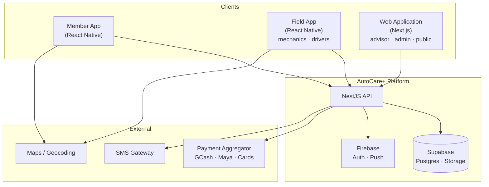

# 2. Overall Description

> [!info] Navigation
> ⬅️ [[01 Introduction]] · ➡️ [[03 Functional Requirements]]

---

## 2.1 Product perspective

AutoCare+ is a **new, self-contained system** — it does not replace an existing product. It integrates with external services but owns its own data.

Detail in [[07 System Architecture]].

---

## 2.2 User classes and characteristics

| # | User class | Description | Tech literacy | Frequency of use | Priority |
|---|---|---|---|---|---|
| U1 | **Member (Vehicle Owner)** | Subscriber. Books services, views VHS, requests pick-up and roadside help. | Moderate — familiar with GCash, Grab, Facebook | Weekly to monthly | 🔴 Primary |
| U2 | **Fleet Manager** | Manages multiple vehicles under one corporate account (jeepney co-ops, delivery fleets). | Moderate | Weekly | 🟠 Secondary |
| U3 | **Mechanic / Technician** | Performs inspections, fills the digital checklist that feeds the VHS. | Low to moderate — may be first-time app user | Daily, many times | 🔴 Primary |
| U4 | **Service Advisor** | Front desk. Manages the schedule, creates work orders, quotes parts. | Moderate | Daily | 🔴 Primary |
| U5 | **Driver (Pick-up & Delivery)** | Collects and returns vehicles. Updates trip status. | Low | Daily | 🔴 Primary |
| U6 | **Administrator / Owner** | Configures plans, pricing, capacity; reads business analytics. | High | Weekly | 🟠 Secondary |
| U7 | **Prospective Buyer** | Non-user. Views a shared, read-only VHS certificate via public link. | Any | One-off | 🟡 Tertiary |

> [!important] Design implication of U3 and U5
> The mechanic and driver interfaces must be usable by staff with low app familiarity, potentially wearing gloves, in bright outdoor light. This drives [[04 Non-Functional Requirements#Usability|NFR usability targets]]: large tap targets, high contrast, minimal typing, offline tolerance.

---

## 2.3 Operating environment

| Aspect | Specification |
|---|---|
| Member app | React Native — iOS 14+, Android 8.0 (API 26)+ |
| Field app (mechanics, drivers) | React Native — Android 8.0+ (company-issued phones/tablets) |
| Web application (advisor desk, admin console, public certificates) | Next.js 14+ — Chrome, Edge, Safari (last 2 versions), desktop-first, responsive |
| Backend | NestJS on Node.js 20 LTS, containerised |
| Database & file storage | Supabase (managed Postgres 15 + Supabase Storage), free tier initially |
| Auxiliary services | Firebase Auth (email/password + Google) and Cloud Messaging — free (Spark) tier |
| Network | Philippine mobile data (4G typical, 3G in outlying barangays); intermittent |
| Devices | Predominantly mid-range Android; assume 2–4 GB RAM, modest CPU |

> [!warning] Connectivity assumption
> Service areas include outlying routes (Vitali, Nuñez, Curuan). The field app **must** function offline for inspection capture and trip status, syncing when connectivity returns. See [[07 System Architecture#Offline-first strategy]].

---

## 2.4 Design and implementation constraints

These are hard constraints. Full discussion in [[13 Constraints and Risks]].

| ID | Constraint | Source |
|---|---|---|
| C-01 | Mobile clients **must** be built in **React Native** (single codebase, both platforms) | Stakeholder mandate |
| C-01b | Web clients (advisor desk, admin console, public certificate pages) **must** be built in **Next.js** | Stakeholder mandate |
| C-02 | Backend **must** be **NestJS** | Stakeholder mandate |
| C-03 | Persistence **and file storage** on **Supabase**; **Firebase** for auth (email/password + Google) and push — both on free tiers at launch | Stakeholder mandate + budget |
| C-04 | Payments must support **both COD and e-payments** (GCash, Maya, cards) | Stakeholder mandate + market reality |
| C-05 | All personal and vehicle data handling must comply with **RA 10173 (DPA)** | Legal |
| C-06 | v1.0 MVP includes the **complete feature set** — no phased feature deferral | Stakeholder mandate |
| C-07 | Free-tier service quotas cap storage, bandwidth, and concurrent connections | Budget |
| C-08 | Hazardous waste disposal events must be recorded and exportable for DENR reporting | Regulatory |

---

## 2.5 Assumptions and dependencies

> [!note] Assumptions
> - **A-01** — Members own a smartphone with mobile data and are already using at least one e-wallet.
> - **A-02** — A physical service centre with at least 2 service bays exists at launch.
> - **A-03** — Staff devices are company-issued and centrally managed.
> - **A-04** — A payment aggregator (PayMongo or Xendit) will approve a merchant account before launch.
> - **A-05** — Inspection checklists are authored by a qualified mechanic and are stable at launch (versioned thereafter).
> - **A-06** — Roadside assistance towing is fulfilled by a contracted third party, not owned assets.

> [!danger] Dependencies that can block launch
> - **D-01** — Payment aggregator merchant approval (external, multi-week lead time).
> - **D-02** — Apple App Store and Google Play review approval.
> - **D-03** — Firebase Cloud Messaging availability for push (no fallback except SMS, which costs per message).
> - **D-04** — Supabase free-tier project not being paused for inactivity during long development gaps.
> - **D-05** — Supabase Storage staying within the 1 GB free-tier ceiling, which the photo lifecycle policy (C-07) exists to protect.

---

## 2.6 Business rules feeding the software

| ID | Business rule | Where enforced |
|---|---|---|
| BR-01 | A member must complete a **minimum 6-month lock-in** before cancelling without penalty | [[03 Functional Requirements#3.2 M2 — Subscription & Billing]] |
| BR-02 | Roadside assistance is unlocked only after the **first successful payment clears + 30 days** | FR-034 |
| BR-03 | Each plan tier has a **monthly service entitlement quota** (e.g. 1 inspection / month); excess is billable | FR-021 |
| BR-04 | Booking cannot exceed the **daily bay capacity** configured by the administrator | FR-042 |
| BR-05 | A VHS is only valid for **90 days** from its inspection date; after that it is marked stale | [[11 Vehicle Health Score Algorithm#Score validity and decay]] |
| BR-06 | Only a **certified technician account** may submit an inspection that changes the VHS | FR-058 |
| BR-07 | Parts recommendations above a configurable amount require **explicit member approval** in-app before work proceeds | FR-066 |
| BR-08 | Cancellation inside the lock-in triggers a **pro-rated early termination fee** | FR-028 |

---

## 2.7 Feature summary (module map)

| Module | Purpose | Requirements |
|---|---|---|
| **M1 — Identity & Accounts** | Registration, login, profile, roles | FR-001 → FR-015 |
| **M2 — Subscription & Billing** | Plans, recurring charges, lock-in, cancellation | FR-016 → FR-030 |
| **M3 — Roadside Assistance** | Emergency request, dispatch, tracking | FR-031 → FR-040 |
| **M4 — Scheduling & Capacity** | Booking, calendar, bay/mechanic capacity | FR-041 → FR-052 |
| **M5 — Inspection & VHS** | Checklists, scoring, certificates | FR-053 → FR-065 |
| **M6 — Work Orders & Parts** | Job tracking, quotes, approvals, upsell | FR-066 → FR-074 |
| **M7 — Pick-up & Delivery** | Trip request, driver assignment, tracking | FR-075 → FR-082 |
| **M8 — Payments** | COD and e-payment capture, reconciliation | FR-083 → FR-089 |
| **M9 — Notifications** | Push, in-app, SMS fallback | FR-090 → FR-095 |
| **M10 — Admin & Analytics** | Configuration, reporting, waste log | FR-096 → FR-108 |
| **M11 — Attention Dashboard & Visualization** | "What Needs Attention" home screen, star ratings, per-component tap-to-explain, deferred 2D diagram | FR-109 → FR-117 |

---

> [!info] Navigation
> ⬅️ [[01 Introduction]] · ➡️ [[03 Functional Requirements]]
