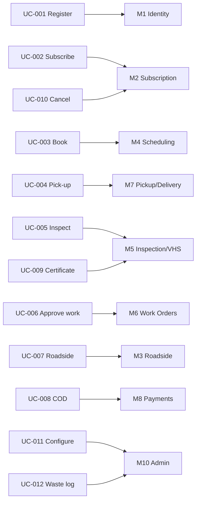

# 6. Use Cases

> [!info] Navigation
> ⬅️ [[05 External Interface Requirements]] · ➡️ [[07 System Architecture]]

---

## 6.1 Actor–goal list

| UC | Use case | Primary actor | Priority |
|---|---|---|---|
| UC-001 | Register and onboard a vehicle | Member | 🔴 |
| UC-002 | Subscribe a vehicle to a plan | Member | 🔴 |
| UC-003 | Book a maintenance appointment | Member | 🔴 |
| UC-004 | Request vehicle pick-up | Member | 🔴 |
| UC-005 | Perform a vehicle inspection | Mechanic | 🔴 |
| UC-006 | Review and approve recommended work | Member | 🔴 |
| UC-007 | Request roadside assistance | Member | 🔴 |
| UC-008 | Pay by COD at hand-over | Driver / Advisor | 🔴 |
| UC-009 | Share a Vehicle Health Score certificate | Member | 🔴 |
| UC-010 | Cancel a subscription inside lock-in | Member | 🟠 |
| UC-011 | Configure capacity and plans | Administrator | 🔴 |
| UC-012 | Export hazardous waste log | Administrator | 🟠 |

---

## 6.2 Detailed use cases

### UC-001 — Register and onboard a vehicle

> [!abstract] Summary
> A prospective member creates an account, verifies their number, and adds their first vehicle.

| Field | Value |
|---|---|
| **Actor** | Member |
| **Preconditions** | App installed; mobile data available |
| **Postconditions** | Verified account exists with ≥ 1 vehicle attached |
| **Requirements** | FR-001 → FR-006, FR-012 |

**Main flow**

1. Member opens the app and taps *Create Account*.
2. Member enters email address, name, mobile number, and password. *(FR-001)*
3. System displays the DPA consent statement; member accepts. *(FR-012)*
4. System creates the account and sends a verification link to the email address. *(FR-002)*
5. Member opens the link; system marks the address verified and unlocks the rest of onboarding.
6. System prompts to add a vehicle.
7. Member enters plate number, make, model, year, and odometer. *(FR-004)*
8. System validates the plate format and checks for duplicates. *(FR-005)*
9. Member optionally uploads vehicle and OR/CR photos. *(FR-006)*
10. System saves the vehicle and shows the plan selection screen.

**Alternate flows**

- **3a.** Member declines consent → registration cannot proceed; system explains why and exits.
- **4a.** Verification email not received → member taps *Resend* after 60 s; max 3 resends, then a support contact is offered. Members may browse the app in a limited state while unverified, but cannot select a plan.
- **8a.** Plate already registered to another account → system asks the member to contact support (prevents ownership disputes).

---

### UC-005 — Perform a vehicle inspection

> [!abstract] Summary
> A mechanic completes a structured checklist which generates the Vehicle Health Score.

| Field | Value |
|---|---|
| **Actor** | Mechanic |
| **Preconditions** | Work order exists in `IN_PROGRESS`; mechanic authenticated with certification flag |
| **Postconditions** | Immutable inspection record stored; VHS computed; recommendations generated |
| **Requirements** | FR-053 → FR-061, FR-066 |

**Main flow**

1. Mechanic opens the field app and selects the assigned work order.
2. System loads the current checklist version and pre-fills the vehicle context.
3. Mechanic records the odometer reading. *(FR-048, NFR-056)*
4. For each inspection point, mechanic sets status and, where applicable, enters a measured value. *(FR-055, FR-056)*
5. System derives status from thresholds for measured points and highlights any mismatch with the mechanic's manual selection.
6. Mechanic attaches photos for any `ATTENTION` or `CRITICAL` finding. *(mandatory)*
7. Mechanic reviews the summary and submits.
8. System validates completeness — every non-N/A point must have a status.
9. System stores the inspection immutably. *(NFR-054)*
10. System computes the VHS and category sub-scores. *(FR-059, FR-060)*
11. System generates recommended work items from adverse findings. *(FR-066)*
12. System notifies the member that results are ready.

**Alternate flows**

- **4a.** Device offline → all input is queued locally; a banner shows pending sync. Steps 9–12 execute on reconnect. *(FR-057, FR-082)*
- **6a.** Photo missing on a `CRITICAL` finding → submission is blocked with an explanatory message.
- **8a.** Incomplete checklist → system lists the missing points and returns the mechanic to them.
- **10a.** VHS falls below 50 → system flags the vehicle as *Needs Urgent Attention* and escalates to the service advisor.

---

### UC-007 — Request roadside assistance

> [!abstract] Summary
> A stranded member requests emergency help and tracks the response.

| Field | Value |
|---|---|
| **Actor** | Member |
| **Preconditions** | Active subscription; location permission granted |
| **Postconditions** | Assistance request logged, dispatched, and resolved |
| **Requirements** | FR-031 → FR-040 |

**Main flow**

1. Member taps the emergency button on the home screen. *(FR-031)*
2. System checks eligibility per **BR-02**. *(FR-034)*
3. System captures GPS coordinates and reverse-geocodes the address. *(FR-032)*
4. Member selects the incident type and optionally adds a note or photo. *(FR-033)*
5. Member confirms the request.
6. System notifies all on-duty service advisors within 30 s. *(FR-036)*
7. Advisor acknowledges and dispatches a driver or tow partner. *(FR-037)*
8. System pushes status updates to the member as the state advances. *(FR-038)*
9. Responder arrives, resolves the issue, and records the outcome. *(FR-039)*
10. System closes the request and logs cost against the member's usage record. *(FR-099)*

**Alternate flows**

- **2a.** Member not yet eligible → system explains and offers a paid callout with an upfront price. *(FR-035)*
- **3a.** GPS unavailable → member enters a landmark description manually.
- **6a.** No advisor acknowledges within 3 minutes → system escalates by SMS and phone call to the on-call manager.
- **Any step.** App request fails entirely → member uses the always-visible hotline button. *(FR-040)*

---

### UC-008 — Pay by COD at hand-over

> [!abstract] Summary
> A driver collects cash when returning a serviced vehicle.

| Field | Value |
|---|---|
| **Actor** | Driver |
| **Preconditions** | Work order in `READY`; member selected COD |
| **Postconditions** | Payment recorded; receipt issued; work order `CLOSED` |
| **Requirements** | FR-084 → FR-086, FR-079 |

**Main flow**

1. Driver opens the delivery trip and reviews the amount due.
2. Driver hands over the vehicle and presents the itemised total.
3. Member pays cash; driver records amount tendered. *(FR-085)*
4. System calculates change and confirms.
5. Member signs digitally on the driver's device, or confirms in their own app session if not present in person. *(FR-079)*
6. System issues a digital receipt by push and SMS.
7. System marks the work order `CLOSED` and adds the collection to the driver's daily cash bag. *(FR-086)*
8. Driver remits cash at the service centre; advisor reconciles against the system total.

**Alternate flows**

- **3a.** Member has insufficient cash → driver records a partial payment; the balance becomes an outstanding invoice and the vehicle is still released (policy decision — flag for owner sign-off).
- **3b.** Member switches to e-payment → driver triggers an in-app payment link; system waits for webhook confirmation before releasing.
- **Any step.** Device offline → the collection is queued locally with a client UUID and syncs later; the printed/queued receipt number is reserved offline. *(FR-082)*

---

### UC-009 — Share a Vehicle Health Score certificate

> [!abstract] Summary
> A member selling their car shares a verifiable maintenance record with a buyer.

| Field | Value |
|---|---|
| **Actor** | Member; secondary actor: Prospective Buyer |
| **Preconditions** | At least one inspection exists for the vehicle |
| **Postconditions** | A revocable public link and PDF exist |
| **Requirements** | FR-064, FR-065, NFR-022 |

**Main flow**

1. Member opens the vehicle and taps *Share Health Certificate*.
2. System warns if the latest score is `STALE` (> 90 days) and offers to book a fresh inspection. *(FR-063)*
3. Member confirms sharing.
4. System generates a public token, a web certificate page, and a PDF. *(FR-064)*
5. System redacts the member's contact details from the public view. *(FR-065)*
6. Member shares the link or PDF outside the app.
7. Buyer opens the link and sees score, category breakdown, inspection date, odometer, service history summary, and a verification code.
8. Member may revoke the link at any time; revoked links return a neutral "no longer available" page.

**Alternate flows**

- **2a.** No inspection exists → system blocks sharing and prompts to book one.
- **7a.** Buyer enters the verification code on the public site → system confirms authenticity independently of the link.

---

## 6.3 Use case to module map

Full traceability in [[15 Requirements Traceability Matrix]].

---

> [!info] Navigation
> ⬅️ [[05 External Interface Requirements]] · ➡️ [[07 System Architecture]]
