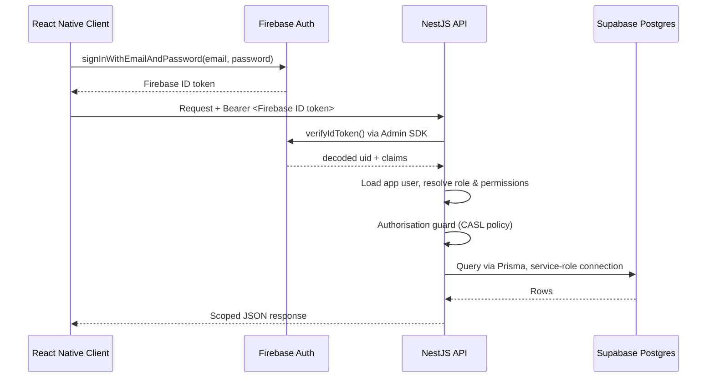
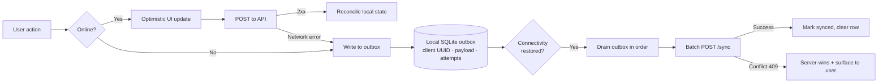
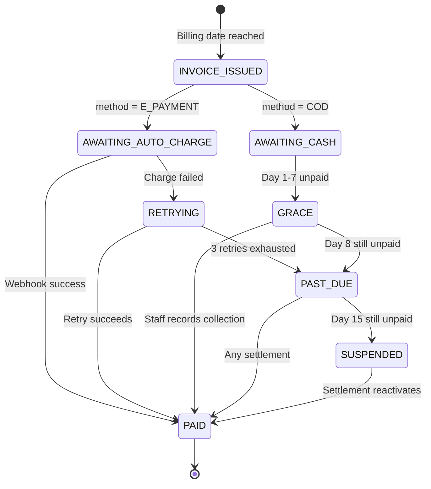
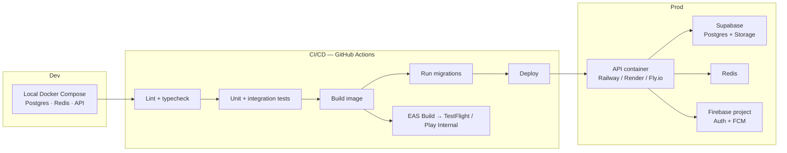

# 7. System Architecture

> [!info] Navigation
> ⬅️ [[06 Use Cases]] · ➡️ [[08 Data Model]] · 🏠 [[AutoCare+ MOC]]

---

## 7.1 Architectural style

**A modular monolith behind a single API, with three clients: two React Native apps and one Next.js web application.**

> [!important] Why not microservices
> At 500 target subscribers, one service centre, and a small team, microservices buy you distributed-systems problems you do not have the headcount to solve. NestJS modules give clean internal boundaries — each module owns its domain and exposes a service interface — so if a module ever needs to become its own service, the seam already exists. Start simple, keep the seams.

```mermaid
graph TB
    subgraph CL["Client Layer"]
        MA["<b>Member App</b><br/>React Native<br/>members, fleet managers"]
        SA["<b>Field App</b><br/>React Native<br/>mechanics, drivers"]
        AC["<b>Web Application</b><br/><b>Next.js</b><br/>advisor desk · admin · public"]
    end

    subgraph GW["Gateway"]
        NG["Nginx / Managed Ingress<br/>TLS · rate limit · routing"]
    end

    subgraph API["Application Layer — NestJS Modular Monolith"]
        AUTH["AuthModule"]
        SUB["SubscriptionModule"]
        SCHED["SchedulingModule"]
        INSP["InspectionModule"]
        VHS["<b>ScoringModule</b><br/>pure VHS engine"]
        WO["WorkOrderModule"]
        TRIP["LogisticsModule"]
        PAY["PaymentModule"]
        NOTIF["NotificationModule"]
        ADMIN["AdminModule"]
        SYNC["SyncModule<br/>offline reconciliation"]
        JOBS["JobsModule<br/>BullMQ scheduler"]
    end

    subgraph DATA["Data Layer"]
        PG[("<b>Supabase</b><br/>Postgres 15")]
        REDIS[("Redis<br/>cache · queues")]
        FS["<b>Supabase</b><br/>Storage"]
    end

    subgraph EXT["External Services"]
        FBA["Firebase Auth"]
        FCM["Firebase Cloud Messaging"]
        PSP["Payment Aggregator<br/>PayMongo / Xendit"]
        SMS["SMS Gateway"]
        MAPS["Maps / Geocoding"]
    end

    MA --> NG
    SA --> NG
    AC --> NG
    NG --> API

    AUTH --> FBA
    PAY --> PSP
    NOTIF --> FCM
    NOTIF --> SMS
    TRIP --> MAPS
    INSP --> FS

    AUTH --> PG
    SUB --> PG
    SCHED --> PG
    INSP --> PG
    WO --> PG
    TRIP --> PG
    PAY --> PG
    ADMIN --> PG
    SYNC --> PG
    JOBS --> REDIS
    SCHED --> REDIS

    INSP --> VHS
```



---

## 7.2 Technology stack and rationale

| Layer | Technology | Why |
|---|---|---|
| Mobile clients | **React Native** (Expo bare / CLI), TypeScript | Stakeholder constraint **C-01**. One codebase, two platforms — decisive for a small team. |
| State & data fetching | TanStack Query + Zustand | Query handles server cache, retries, and optimistic updates; Zustand for local UI state. Avoids Redux boilerplate. |
| Offline persistence | WatermelonDB or SQLite (`op-sqlite`) + a custom outbox | Required by FR-057 and FR-082. AsyncStorage is not adequate for structured, queryable offline records. |
| Navigation | React Navigation (native stack) | Standard; good deep-link support for VHS certificates. |
| **Web application** | **Next.js 14+ (App Router), TypeScript** | Serves three surfaces from one codebase: the **advisor desk portal**, the **admin console**, and the **public VHS certificate pages**. Server components keep data-dense dashboards fast; SSR is required for shareable, link-previewable certificate pages. See §7.4a. |
| Web data tables | TanStack Table + shadcn/ui | Dense schedule boards, quote builders, and reports. |
| Backend | **NestJS** on Node.js 20, TypeScript | Stakeholder constraint **C-02**. Modules, DI, guards, and interceptors map cleanly onto this domain. Shares a language with the clients. |
| ORM | Prisma | Type-safe queries, first-class migrations (NFR-044), generated types shared with clients. |
| Database | **Supabase** (managed Postgres 15) | Constraint **C-03**. Relational is the correct fit — vehicles, inspections, work orders, and payments are deeply relational. Free tier at launch. |
| Auth | **Firebase Auth — email/password + Google** | Constraint **C-03**. Free on the Spark tier, handles credential storage, password reset, and token refresh without you building it. **Email/password is the primary member credential; phone/SMS OTP is explicitly out of scope** (see §7.3a). |
| Push | **Firebase Cloud Messaging** | Free, unified iOS/Android. |
| File storage | **Supabase Storage** | Same vendor and project as the database — one dashboard, one billing surface, one set of credentials. S3-compatible, serves inspection photos and generated PDFs behind signed URLs. |
| Cache & queues | Redis + BullMQ | Billing runs, reminder dispatch, PDF generation, webhook retries. |
| Real-time | Socket.IO | Roadside status, trip tracking, work order updates. |
| Container | Docker | NFR-036 — portability off the free tier. |
| Observability | Sentry + structured Pino logs | NFR-041, NFR-042. |

---

## 7.3 Reconciling Firebase Auth with Supabase RLS

> [!danger] The single most important architectural decision in this document
> You are using **two vendors that both expect to own identity**. Supabase Row-Level Security works off Supabase-issued JWTs. Firebase issues different tokens. If you ignore this, you will either disable RLS (unsafe) or fight token translation forever.

**The resolution: the NestJS API is the only database client.**



**Rules that follow from this, and must not be broken:**

1. ❌ Mobile clients **never** hold a Supabase key and **never** call Supabase directly — this covers **Storage as well as the database**.
2. ✅ The Supabase service-role credential lives **only** in the NestJS environment.
3. ✅ Authorisation is enforced in the API layer via NestJS guards + CASL policies, tested as business logic.
4. ✅ RLS is still **enabled** on every table as defence-in-depth, with a policy permitting only the service role — so a leaked anon key yields nothing. Storage buckets are **private** with the equivalent policy.
5. ✅ Firebase `uid` is stored on the `users` table as `firebase_uid` (unique, indexed). It is the only coupling point.
6. ✅ Clients reach files only through **short-lived signed URLs minted by the API** after it has run the same CASL check it would run on a database read. A photo URL is an authorisation decision, not a public link.

> [!tip] The escape hatch this buys you
> Because identity touches the system in exactly one place (`AuthModule.verifyToken`), migrating from Firebase Auth to Supabase Auth later — or to anything else — is a one-module change. Given both are free tiers that may change terms, that optionality is worth having.

---

## 7.3a Why email/password rather than phone OTP

> [!important] Decision — supersedes the original OTP-first design
> Member sign-up and sign-in use **email + password** (with Google as the social option). Phone/SMS OTP is **not** implemented in v1.0.

Three reasons, in order of weight:

1. **Cost and plan tier.** Firebase's SMS verification is a Blaze (pay-as-you-go) feature — it is not available on the free Spark plan, and every verification message is billed. Email/password and Google sign-in are free on Spark. Removing OTP removes the only hard requirement to attach a billing card before launch.
2. **No SMS dependency in the critical path.** OTP put a paid third party (Semaphore/Twilio) between a member and their first session. Delivery delays and carrier filtering in PH are a real registration-funnel risk; email removes that class of failure from onboarding entirely.
3. **One credential model across all three clients.** Web (advisor desk, admin) and the field app already sign in with email/password. Making the member app match collapses three auth flows into one, and lets `AuthModule.verifyToken` stay a single code path.

**What this changes downstream:**

| Area | Before | Now |
|---|---|---|
| Member registration | Mobile number + SMS OTP | Email + password, verification link to that email |
| Credential recovery | OTP to registered mobile | Firebase password-reset email |
| `users.mobile` | Identity key, required | Contact detail, still collected, **no longer the credential** |
| SMS gateway | OTP delivery + critical alerts | **Critical alerts only** (FR-091 fallback) |
| Trip hand-over confirmation | Digital signature **or** OTP | Digital signature (see FR-079) |

> [!note] The mobile number does not disappear
> It is still captured at registration and still used for roadside dispatch and critical SMS fallback. It simply stops being the thing that proves who you are.

---

## 7.4 NestJS module structure

```
src/
├── main.ts
├── app.module.ts
├── common/
│   ├── guards/            # AuthGuard, RolesGuard, PolicyGuard
│   ├── interceptors/      # ResponseEnvelope, Logging, Timeout
│   ├── filters/           # GlobalExceptionFilter
│   ├── decorators/        # @CurrentUser, @Roles, @Public
│   └── money/             # Centavo value object — no floats anywhere
├── config/                # Typed env config, validated at boot
├── modules/
│   ├── auth/              # Firebase verification, session, roles
│   ├── users/             # Profiles, consent records, DPA requests
│   ├── vehicles/          # Vehicle registry, odometer history
│   ├── subscriptions/     # Plans, entitlements, lock-in, lifecycle
│   ├── scheduling/        # Slots, capacity engine, appointments
│   ├── inspections/       # Checklists, versions, submissions
│   ├── scoring/           # ⭐ Pure VHS engine — zero I/O
│   ├── work-orders/       # Jobs, quotes, approvals, parts, waste log
│   ├── logistics/         # Pick-up & delivery trips, driver assignment
│   ├── roadside/          # Emergency requests, dispatch
│   ├── payments/          # COD + e-payment, webhooks, reconciliation
│   ├── notifications/     # Push, SMS fallback, preferences
│   ├── sync/              # Offline outbox reconciliation
│   ├── certificates/      # Public VHS certificate + PDF generation
│   ├── admin/             # Configuration, analytics, exports
│   └── jobs/              # BullMQ processors
└── prisma/
    ├── schema.prisma
    └── migrations/
```

> [!note] `scoring` has no dependencies on purpose
> `ScoringModule` imports nothing but types. It takes an inspection payload plus a config version and returns a `ScoreResult`. No database, no clock, no network. This makes it exhaustively unit-testable (NFR-039) and guarantees historical reproducibility (NFR-055). Everything else may be messy; this module must stay pure.

---

## 7.4a Web application architecture (Next.js)

> [!question] Why Next.js, and what exactly runs on it
> **NestJS** (backend framework) and **Next.js** (React web framework) are different tools with confusingly similar names — the design uses both. NestJS is the API. Next.js is the web client for everyone who works at a desk or arrives via a shared link.

### The three surfaces it serves

| Surface | Users | Why web, not React Native |
|---|---|---|
| **Advisor desk portal** `/staff` | Service Advisors | The advisor sits at a counter with a keyboard and a large monitor. A day/week/bay schedule board, a quote builder, and a dispatch queue are all dense, multi-column, keyboard-driven screens. Cramming them into a phone app makes the busiest role in the business slower. |
| **Admin console** `/admin` | Administrator, Owner | Reports, checklist and weight editors, plan builders, CSV exports. Nobody tunes scoring weights on a phone. |
| **Public certificate pages** `/c/:token` | Prospective buyers 🌐 | Must be **server-rendered** — a link shared on Facebook Marketplace or Viber needs an OpenGraph preview and must open instantly for someone who has never heard of AutoCare+. A React Native app cannot serve this at all, and a client-rendered SPA previews as a blank card. |

### What stays in React Native

| Role | Client | Why |
|---|---|---|
| Mechanic | Field app (RN) | Camera-heavy inspection capture, offline queue, one-handed use in a bay |
| Driver | Field app (RN) | GPS tracking, offline trip updates, signature capture, roadside response |
| Member | Member app (RN) | Push notifications, SOS button, location for roadside |

> [!important] The split is decided by *where the work happens*, not by role title
> Anything performed **on a vehicle or on the road** is React Native — it needs camera, GPS, push, and offline. Anything performed **at a desk** is Next.js — it needs screen area and a keyboard. The Service Advisor genuinely straddles both, so the portal is responsive and the few advisor actions that occur away from the desk (dispatching a roadside call) are duplicated in the field app.

### Structure

```
web/
├── app/
│   ├── (public)/
│   │   ├── c/[token]/page.tsx        # 🌐 SSR certificate — OG tags, no auth
│   │   ├── verify/page.tsx           # 🌐 Verification by code
│   │   └── legal/[doc]/page.tsx      # 🌐 Privacy policy, terms (versioned)
│   ├── (staff)/
│   │   ├── schedule/                 # Day / week / bay board
│   │   ├── work-orders/[id]/         # Detail, quote builder, approvals
│   │   ├── roadside/                 # Live dispatch queue
│   │   ├── trips/                    # Driver assignment
│   │   └── cash/                     # Shift open/close, remittance
│   ├── (admin)/
│   │   ├── dashboard/                # MRR, churn, utilisation
│   │   ├── plans/                    # Plan and entitlement builder
│   │   ├── checklists/               # Checklist + weight editor (versioned)
│   │   ├── capacity/                 # Bays, shifts, holidays, buffer
│   │   ├── reports/                  # Redemption, margin, roadside cost, waste
│   │   └── audit/                    # Audit log viewer
│   ├── login/
│   └── layout.tsx
├── components/                       # shadcn/ui + shared design tokens
├── lib/
│   ├── api/                          # Typed client — same generated types as RN
│   ├── auth/                         # Firebase web SDK + httpOnly session cookie
│   └── realtime/                     # Socket.IO for dispatch and status
└── middleware.ts                     # Route protection by role
```

### Rules

| Rule | Detail |
|---|---|
| **Next.js is a client, not a second backend** | All business logic stays in NestJS. Next.js Route Handlers are used only for the auth session cookie and OG image generation — never for domain logic. There is exactly one source of truth for rules. |
| **Auth** | Firebase Web SDK signs in; the ID token is exchanged for an **httpOnly, secure, sameSite session cookie** so server components can authenticate. Tokens never sit in `localStorage`. |
| **Authorisation** | `middleware.ts` gates route groups by role; the API re-checks every request regardless. Never trust the client boundary. |
| **Shared types** | The API's generated TypeScript types are consumed by both `web/` and the RN apps, so an endpoint change breaks the build rather than production. |
| **Design system** | One token set (colour, type, spacing) shared across Next.js and React Native, so the products look like one product. |
| **Rendering** | Server components for reports and certificates; client components only where interactive (schedule drag-and-drop, live dispatch). |
| **Public pages** | No auth, no personal contact data, aggressive caching with on-revoke invalidation (FR-065). |

### Deployment

Vercel free/hobby tier at launch, or the same container host as the API. The certificate pages are the only public-facing web surface, so keep them on a CDN-backed edge — a shared link that loads slowly undermines the resale-trust proposition.

---

## 7.5 Mobile app architecture (React Native)

```
src/
├── app/                      # Navigation, providers, deep links
├── features/                 # Vertical slices, mirroring API modules
│   ├── auth/
│   ├── vehicles/
│   ├── subscription/
│   ├── booking/
│   ├── inspection/           # Field app only
│   ├── health-score/
│   ├── roadside/
│   ├── trips/
│   └── payments/
├── shared/
│   ├── api/                  # Typed client, interceptors, refresh
│   ├── db/                   # SQLite schema, offline outbox
│   ├── sync/                 # Queue processor, conflict handling
│   ├── ui/                   # Design system components
│   └── hooks/
└── config/
```

### Offline-first strategy

Required by FR-057, FR-082, NFR-014. Applies to the **field app** (mechanics and drivers). The Next.js web app is desk-bound and assumes connectivity.



**Rules:**

| Rule | Detail |
|---|---|
| Client-generated IDs | Every offline-creatable record gets a client UUID at creation. The server treats it as an idempotency key — replaying a batch never duplicates. |
| Ordered drain | Outbox entries drain in creation order per entity, so status transitions apply correctly. |
| Conflict policy | **Server wins** for scheduling and payments (authoritative); **client wins** for inspection content (the mechanic was physically there). |
| Photo handling | Photos are compressed to ≤ 500 KB (NFR-006), stored in the app's document directory, and uploaded separately from the JSON payload; the record syncs first, photos attach after. |
| Durability | The outbox is SQLite on disk, surviving app kill and reboot (NFR-014). |
| Visibility | A persistent banner shows pending item count; staff never wonder whether their work saved. |

---

## 7.6 Payment architecture — COD and e-payment together

> [!warning] This is the awkward part of the design, handled explicitly
> A subscription model assumes auto-charging a stored instrument. Cash cannot be auto-charged. Excluding cash would exclude much of the target market. So the system models **payment intent** and **payment settlement** as separate concepts.



| Concern | Design response |
|---|---|
| COD subscribers can't be auto-charged | Invoice issued on the billing date; a 7-day **grace** window keeps entitlements live; suspension at day 15. |
| Cash collection points | Service counter (advisor) **and** at delivery hand-over (driver). Both record into the same ledger. |
| Cash accountability | Every collection is bound to a staff user and a shift; daily remittance report reconciles system total vs cash counted (FR-086). |
| Offline cash collection | Receipt numbers are pre-allocated in blocks to each device so offline receipts stay unique and sequential. |
| Card data | Never touches AutoCare+ servers — aggregator-hosted checkout and tokens only (FR-087, NFR-020). |
| Webhook safety | HMAC-verified, idempotency-keyed, replay-safe; every webhook is persisted raw before processing (FR-088). |
| Money representation | Integer centavos everywhere, `bigint` columns. No floats. |

---

## 7.7 Scheduling and capacity engine

The component most likely to determine whether members stay or churn.

```
availableSlots(date, serviceType) =
    operatingWindow(date)
      ├─ minus holidays and blocked bays
      ├─ divided into slots of standardDuration(serviceType)
      ├─ constrained by concurrent bay count
      ├─ constrained by mechanics on shift with required skill
      ├─ minus existing appointments and holds
      └─ minus reserved buffer for walk-ins and roadside recovery
```

| Design point | Detail |
|---|---|
| Slot holds | A 10-minute Redis-TTL hold prevents double-booking during checkout (FR-043). |
| Two-resource constraint | A slot needs **both** a free bay and a qualified mechanic; either being exhausted closes the slot. |
| Walk-in buffer | A configurable share of daily capacity is withheld from online booking — cash walk-ins and roadside recoveries are real and must not be crowded out. |
| Load shaping | Reminders (FR-047) are dispatched in staggered batches rather than all on the 1st of the month, so demand spreads across the month instead of spiking. |
| Utilisation alarm | When forward bookings exceed the configured threshold, FR-052 warns the administrator **before** members start waiting weeks. |

> [!important] Capacity is the business's failure mode, expressed in software
> The source concept identifies this precisely: subscribers who cannot get an appointment they already paid for will cancel. The load-shaping and utilisation-alarm features exist specifically to make that failure visible early. Do not cut them.

---

## 7.8 Background jobs

| Job | Schedule | Purpose |
|---|---|---|
| `billing.issueInvoices` | Daily 01:00 | Issue invoices due today |
| `billing.autoCharge` | Daily 02:00 | Charge e-payment subscriptions |
| `billing.retryFailed` | Daily 03:00 | Retry on days 1, 3, 7 (FR-026) |
| `subscription.evaluateStates` | Daily 04:00 | Grace → past due → suspended transitions |
| `entitlements.resetCycle` | Daily 00:30 | Reset quotas at cycle boundaries |
| `reminders.serviceDue` | Daily 08:00 | Staggered due-service reminders (FR-047) |
| `reminders.appointment` | Hourly | T-24h and T-2h appointment reminders |
| `scores.markStale` | Daily 05:00 | Flag scores past 90 days (FR-063) |
| `certificates.generatePdf` | On demand | Async PDF rendering |
| `webhooks.retryUnprocessed` | Every 15 min | Reprocess failed webhooks |
| `quota.checkFreeTier` | Daily 06:00 | Warn at 80 % of any free-tier quota (NFR-045) |
| `reports.dailyRemittance` | Daily 20:00 | Cash reconciliation report (FR-086) |

---

## 7.9 Deployment



| Environment | Purpose | Data |
|---|---|---|
| Local | Development | Seeded synthetic |
| Staging | QA, UAT, aggregator sandbox | Anonymised |
| Production | Live | Real, backed up daily |

> [!note] Free-tier operational caution
> Supabase free-tier projects pause after a week of inactivity, cap the database at **500 MB** and Storage at **1 GB** with **5 GB/month egress**, and allow only **2 active projects** per account — which staging and production consume outright. Firebase Spark covers email/password auth and FCM at no cost. Three mitigations: (1) a scheduled keep-alive ping to staging and production, (2) the `quota.checkFreeTier` job at 80 % so you upgrade **before** members hit a wall rather than after, (3) the photo lifecycle policy (C-07) — inspection photos are the only asset class that can plausibly exhaust 1 GB. Tracked as risk **R-03** in [[13 Constraints and Risks#13.3 Technical risks]].
>
> Consolidating file storage onto Supabase means **one** free-tier ceiling to watch instead of two, but it is a *tighter* ceiling than Firebase Storage's — 1 GB against 5 GB. Budget the photo retention window accordingly.

---

## 7.10 Cross-cutting concerns

| Concern | Approach |
|---|---|
| **Error handling** | Global exception filter → standard envelope from [[05 External Interface Requirements#API response envelope]]; domain errors carry stable machine codes. |
| **Logging** | Pino structured JSON, correlation ID generated at the client and propagated end to end. |
| **Validation** | `class-validator` DTOs at every boundary; Zod schemas shared with clients for one source of truth. |
| **Authorisation** | CASL ability per role, evaluated in a `PolicyGuard`; unit-tested as business logic. |
| **Idempotency** | Client UUIDs on all create operations; an `idempotency_keys` table with a 24-hour window. |
| **Rate limiting** | `@nestjs/throttler` — 5/min on auth endpoints (NFR-023), 100/min general. |
| **Feature flags** | Database-backed flags so the roadside module or telemetry (Tier 2) can be dark-launched. |
| **Time** | All timestamps stored UTC; presented in `Asia/Manila`. Billing dates computed in `Asia/Manila` to avoid off-by-one-day charges. |

---

## Related

- [[08 Data Model]] — schema behind these modules
- [[09 API Specification]] — endpoint surface
- [[10 Security and Privacy]] — threat model and DPA compliance
- [[11 Vehicle Health Score Algorithm]] — the `ScoringModule` engine
- [[13 Constraints and Risks]] — what this architecture is working around

> [!info] Navigation
> ⬅️ [[06 Use Cases]] · ➡️ [[08 Data Model]] · 🏠 [[AutoCare+ MOC]]
