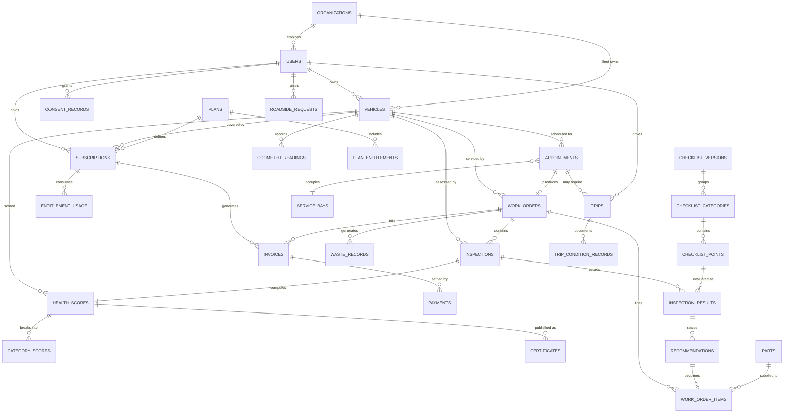

# 8. Data Model

> [!info] Navigation
> ⬅️ [[07 System Architecture]] · ➡️ [[09 API Specification]] · 🏠 [[AutoCare+ MOC]]

---

## 8.1 Answering the freeform-notes question

> [!question] You asked: *"freeform notes? What do you suggest."*

**Structured, with freeform as a companion field — never freeform alone.**

Here is the reasoning, because it's the decision the whole product rests on:

| If service records are… | Consequence |
|---|---|
| **Freeform text only** | You cannot compute a Vehicle Health Score. You cannot generate due-service reminders. You cannot detect that a declined recommendation is still outstanding. You cannot produce a credible resale certificate. The app becomes a notepad. |
| **Structured only** | Fast, computable, but mechanics lose the ability to record the thing the form didn't anticipate — "customer says noise only when turning left after rain." That context is often the diagnostic key. |
| **Structured + freeform companion** ✅ | Every inspection point carries a status and optional measured value (computable), **plus** an optional `notes` field and photos (human context). You get the algorithm and the nuance. |

> [!success] The recommendation
> **Structured is not optional for AutoCare+.** The Vehicle Health Score — your single biggest differentiator — is a function over structured data. Freeform notes cannot be scored, trended, or verified by a prospective buyer. Attach freeform to structure; do not substitute it.

**Where freeform text is appropriate:**

| Field | Entity | Purpose |
|---|---|---|
| `notes` | `inspection_results` | Per-point observations the checklist didn't anticipate |
| `customer_complaint` | `work_orders` | The member's own words — often diagnostically vital |
| `technician_summary` | `work_orders` | Human-readable narrative for the service record |
| `resolution_notes` | `roadside_requests` | What actually happened on scene |
| `damage_notes` | `trip_condition_records` | Pre-existing damage at pick-up |
| `internal_note` | most entities | Staff-only, never shown to the member |

**Where freeform must never be used:** anything that feeds the VHS, entitlement counting, billing, capacity, or the resale certificate.

---

## 8.2 Entity relationship overview

---

## 8.3 Entity dictionary

### Identity and vehicles

| Entity | Key fields | Notes |
|---|---|---|
| `users` | `id`, `firebase_uid` (unique), `email` (unique), `mobile`, `name`, `role`, `org_id?`, `status`, `is_certified_technician` | `firebase_uid` is the sole coupling to Firebase Auth (see [[07 System Architecture#7.3 Reconciling Firebase Auth with Supabase RLS]]). `email` is the sign-in identifier (FR-001); `mobile` is a contact detail, not a credential — see [[07 System Architecture#7.3a Why email/password rather than phone OTP]] |
| `organizations` | `id`, `name`, `type` (`FLEET`\|`INTERNAL`), `tin`, `billing_contact` | Fleet accounts and the service centre itself |
| `consent_records` | `id`, `user_id`, `policy_version`, `consented_at`, `ip`, `withdrawn_at?` | DPA evidence (FR-012) |
| `vehicles` | `id`, `owner_user_id?`, `owner_org_id?`, `plate_no` (unique), `make`, `model`, `year`, `variant`, `engine_cc`, `fuel_type`, `transmission`, `vin?`, `color`, `current_odometer_km`, `status` | Owner is a user **or** an organisation, never both |
| `odometer_readings` | `id`, `vehicle_id`, `km`, `source` (`MEMBER`\|`INSPECTION`\|`TRIP`), `recorded_at`, `recorded_by` | Monotonic constraint per NFR-056 |

### Subscription and billing

| Entity | Key fields | Notes |
|---|---|---|
| `plans` | `id`, `code`, `name`, `price_centavos`, `billing_interval`, `lock_in_months`, `is_active`, `version` | Admin-editable (FR-030); versioned so historical subscriptions keep their terms |
| `plan_entitlements` | `id`, `plan_id`, `entitlement_type`, `quantity_per_cycle`, `overage_price_centavos` | Types: `INSPECTION`, `PICKUP`, `ROADSIDE`, `OIL_CHANGE`, `TIRE_ROTATION` |
| `subscriptions` | `id`, `vehicle_id`, `plan_id`, `user_id`, `status`, `started_at`, `lock_in_ends_at`, `current_period_start/end`, `payment_method`, `cancel_requested_at?` | Status: `ACTIVE`, `GRACE`, `PAST_DUE`, `SUSPENDED`, `CANCELLED` |
| `entitlement_usage` | `id`, `subscription_id`, `entitlement_type`, `period_start`, `used_qty`, `source_ref` | Reset per cycle by a scheduled job |
| `invoices` | `id`, `subscription_id?`, `work_order_id?`, `number` (unique), `total_centavos`, `status`, `due_date`, `issued_at` | Serves both subscription and work-order billing |
| `invoice_items` | `id`, `invoice_id`, `description`, `qty`, `unit_price_centavos`, `tax_centavos` | |
| `payments` | `id`, `invoice_id`, `method` (`GCASH`\|`MAYA`\|`CARD`\|`CASH`), `amount_centavos`, `status`, `psp_reference?`, `collected_by_user_id?`, `shift_id?`, `client_uuid` | `collected_by` and `shift_id` are the COD accountability trail |
| `cash_shifts` | `id`, `user_id`, `opened_at`, `closed_at?`, `expected_centavos`, `counted_centavos`, `variance_centavos` | Daily remittance reconciliation (FR-086) |
| `psp_webhook_events` | `id`, `provider`, `event_id` (unique), `raw_payload`, `processed_at?`, `attempts` | Raw-first persistence for idempotency (FR-088) |

### Scheduling and logistics

| Entity | Key fields | Notes |
|---|---|---|
| `service_bays` | `id`, `name`, `capabilities[]`, `is_active` | Capacity input |
| `staff_shifts` | `id`, `user_id`, `date`, `start_time`, `end_time`, `skills[]` | Mechanic availability |
| `service_types` | `id`, `code`, `name`, `standard_duration_min`, `required_skills[]`, `price_centavos` | Drives slot sizing |
| `appointments` | `id`, `vehicle_id`, `service_type_id`, `bay_id?`, `scheduled_start/end`, `status`, `requires_pickup`, `created_by` | Status: `BOOKED`, `CONFIRMED`, `IN_PROGRESS`, `COMPLETED`, `CANCELLED`, `NO_SHOW` |
| `capacity_blocks` | `id`, `bay_id?`, `date`, `start/end`, `reason` | Holidays, maintenance, walk-in buffer |
| `trips` | `id`, `appointment_id`, `type` (`PICKUP`\|`DELIVERY`), `driver_user_id`, `address`, `lat`, `lng`, `window_start/end`, `status`, `client_uuid` | Offline-creatable. Phase 6 — **not built yet** |
| `trip_condition_records` | `id`, `trip_id`, `stage` (`PRE`\|`POST`), `odometer_km`, `fuel_level`, `photos[]`, `damage_notes`, `signature_url?` | Liability protection (FR-078, FR-079). Phase 6 — **not built yet** |
| `roadside_requests` | `id`, `user_id`, `vehicle_id`, `incident_type`, `lat`, `lng`, `address?`, `landmark_note?`, `status`, `dispatched_to?`, `responder_name?`, `eta_minutes?`, `resolution_notes?`, `cost_centavos?`, `distance_km?`, `created_at`, `acknowledged_at?`, `resolved_at?` | Cost tracked for FR-099. `lat`/`lng` are **member-confirmed**, not the raw GPS fix — the map lets them correct it before dispatch. `address` is nullable because reverse geocoding is best-effort; `landmark_note` is the human fallback (FR-032). `distance_km` is the driving distance from the workshop, computed at resolution (FR-039) |
| `service_zones` | `id`, `name`, `polygon`, `surcharge_centavos` | Out-of-zone pricing (FR-104) — **not built yet** |

### Inspection and scoring entities

> [!important] These tables are the heart of the product
> Their design is what makes [[11 Vehicle Health Score Algorithm]] possible, auditable, and reproducible.

| Entity | Key fields | Notes |
|---|---|---|
| `checklist_versions` | `id`, `version_label`, `effective_from`, `is_active`, `weight_version` | Immutable once published (FR-101) |
| `checklist_categories` | `id`, `checklist_version_id`, `code`, `label_en`, `label_fil`, `weight`, `display_order` | Weights sum to 100 — enforced by constraint |
| `checklist_points` | `id`, `category_id`, `code`, `label_en`, `label_fil`, `weight_in_category`, `is_safety_critical`, `input_type` (`STATUS`\|`MEASURED`), `unit?`, `thresholds` (jsonb), `requires_photo_on_adverse`, `templates` (jsonb), `diagram_zone_id?` | `thresholds` holds the GOOD/MONITOR/ATTENTION/CRITICAL bounds; `templates` holds the tap-to-explain sentence per status (§11.6a); `diagram_zone_id` is nullable and reserved for the v1.1 visual diagram (§11.6b) — no migration needed when that ships |
| `inspections` | `id`, `vehicle_id`, `work_order_id`, `mechanic_user_id`, `checklist_version_id`, `odometer_km`, `started_at`, `submitted_at`, `client_uuid`, `is_offline_captured` | **Immutable after submission** (NFR-054) |
| `inspection_results` | `id`, `inspection_id`, `checklist_point_id`, `status`, `measured_value?`, `unit?`, `source` (`MECHANIC`\|`OBD`\|`SENSOR`), `notes`, `photo_urls[]` | `source` is the Tier 2 hook — no migration needed later |
| `health_scores` | `id`, `vehicle_id`, `inspection_id` (unique), `score`, `raw_score`, `band`, `confidence`, `override_applied`, `checklist_version_id`, `weight_version`, `computed_at`, `is_stale` | Immutable; `is_stale` is display state only |
| `category_scores` | `id`, `health_score_id`, `category_code`, `weight`, `score`, `stars`, `applicable_points` | Sub-score breakdown (FR-060); `stars` is derived and stored for fast rendering (FR-114) |
| `certificates` | `id`, `health_score_id`, `public_token` (unique, ≥128-bit), `verification_code`, `pdf_url?`, `visibility`, `created_at`, `revoked_at?` | FR-064, FR-065, NFR-022 |
| `recommendations` | `id`, `inspection_result_id`, `vehicle_id`, `title`, `severity`, `estimated_cost_centavos`, `status` (`OPEN`\|`APPROVED`\|`DECLINED`\|`DEFERRED`\|`RESOLVED`), `declined_at?`, `resurfaced_count` | Declined items resurface (FR-069) |

### Work orders, parts, and compliance

| Entity | Key fields | Notes |
|---|---|---|
| `work_orders` | `id`, `vehicle_id`, `appointment_id?`, `number` (unique), `status`, `customer_complaint`, `technician_summary`, `advisor_user_id`, `opened_at`, `closed_at?` | Freeform fields live here alongside structured lines |
| `work_order_items` | `id`, `work_order_id`, `type` (`PART`\|`LABOR`), `part_id?`, `description`, `qty`, `unit_price_centavos`, `discount_centavos`, `approval_status`, `approved_at?`, `recommendation_id?` | Per-line approval (FR-068) |
| `parts` | `id`, `sku`, `name`, `category`, `cost_centavos`, `price_centavos`, `stock_qty`, `reorder_level` | Margin reporting (FR-098) |
| `waste_records` | `id`, `work_order_id`, `waste_type` (`USED_OIL`\|`BATTERY`\|`FILTER`\|`TIRE`\|`COOLANT`), `quantity`, `unit`, `hauler_name?`, `manifest_no?`, `disposed_at?` | DENR reporting (FR-074, FR-102, C-08) |
| `audit_log` | `id`, `actor_user_id`, `action`, `entity_type`, `entity_id`, `before` (jsonb), `after` (jsonb), `created_at` | Append-only (FR-103, NFR-021) |
| ~~`notifications`~~ | — | **Superseded by `announcements` (below).** The original shape existed for SMS cost metering (FR-095); SMS was dropped on cost grounds (§7.3a), taking `channel` and `cost_centavos` with it. Never built. |
| `idempotency_keys` | `key` (pk), `endpoint`, `response_hash`, `created_at` | 24-hour window |
| `sync_outbox_receipts` | `client_uuid` (pk), `entity_type`, `entity_id`, `received_at` | Server-side dedupe of offline replays |

### Notifications

Replaces the planned `notifications` table. A notification here is a **thread**, not a log line: one
row follows a service from "due" through "booked", "tomorrow" and "completed", changing `kind` as it
goes rather than adding a row per event. That is why there is no `channel` — every entry is in-app,
and push is not built.

| Table | Key columns | Notes |
|---|---|---|
| `announcements` | `id`, `user_id?`, `kind`, `status`, `title`, `body`, `vehicle_id?`, `service_type_id?`, `appointment_id?`, `roadside_request_id?`, `reason?`, `published_at`, `expires_at?`, `created_by?` | `user_id` null = broadcast to every member (FR-107). `kind` ∈ SERVICE_DUE, APPOINTMENT_BOOKED, APPOINTMENT_REMINDER, APPOINTMENT_RESCHEDULED, APPOINTMENT_CANCELLED, SERVICE_COMPLETED, ROADSIDE_UPDATE, ADMIN_BROADCAST |
| `announcement_reads` | `announcement_id`, `user_id`, `read_at` — composite pk | Read state cannot be a column on the announcement: a broadcast has no single viewer |

Two partial unique indexes carry the rules. `announcements_open_thread` on
(`user_id`, `vehicle_id`, `service_type_id`) WHERE `status = 'ACTIVE'` allows exactly one open
thread per service while keeping closed ones as history. `announcements_roadside_open` on
`roadside_request_id` WHERE `status = 'ACTIVE'` does the same for a call-out — a roadside incident
has no service type, so it cannot use the first index.

`vehicle_id` cascades on delete rather than nulling: a thread is about one vehicle's service, so
once that vehicle is gone the thread is unactionable.

### Privacy, config, and scheduling support

Built alongside the above and previously undocumented.

| Table | Key columns | Notes |
|---|---|---|
| `data_requests` | `id`, `user_id`, `type` (`EXPORT`\|`ERASURE`), `status`, `requested_at`, `completed_at?`, `result_url?` | DPA subject requests (FR-012), processed off a queue |
| `operating_hours` | weekday, open/close times | Shop hours the capacity engine reads |
| `system_config` | key/value | Runtime settings, e.g. the work-order approval threshold |

---

## 8.4 Key design decisions

> [!note] Subscription is per-vehicle, not per-account
> A household with three cars needs three subscriptions. The entitlements (inspections, pick-ups) are consumed by a specific vehicle, and the VHS is a vehicle property. Modelling subscription on the account would make entitlement accounting ambiguous and break fleet use entirely.

> [!note] Money is `bigint` centavos, everywhere
> No `float`, no `numeric` for currency. ₱499.00 is `49900`. This is enforced by naming every column `*_centavos` so a reviewer catches violations instantly.

> [!note] Immutability where trust matters
> `inspections`, `inspection_results`, `health_scores`, `payments`, and `audit_log` are append-only. A correction creates a new record referencing the original via `supersedes_id`. This is what lets a prospective buyer trust a certificate, and what lets you defend a disputed score.

> [!note] Versioning over mutation for configuration
> `checklist_versions`, `plans`, and weight sets are versioned rather than edited in place. A score computed in March must still be reproducible in December even if you retuned the weights in June (NFR-055).

> [!note] `client_uuid` on every offline-creatable entity
> `inspections`, `trips`, `payments`, and `odometer_readings` all carry a client-generated UUID. The server uses it as an idempotency key, so a mechanic's phone replaying an outbox after three days offline never creates duplicates.

---

## 8.5 Critical indexes

| Table | Index | Serves |
|---|---|---|
| `vehicles` | `(plate_no)` unique | Lookup and duplicate prevention (FR-005) |
| `vehicles` | `(owner_user_id, status)` | Member vehicle list |
| `appointments` | `(scheduled_start, bay_id)` | Slot availability query (NFR-005) |
| `appointments` | `(vehicle_id, status)` | Vehicle history |
| `health_scores` | `(vehicle_id, computed_at DESC)` | Latest score, trend chart |
| `inspection_results` | `(inspection_id)` | Score computation |
| `entitlement_usage` | `(subscription_id, period_start, entitlement_type)` unique | Quota enforcement (FR-021) |
| `invoices` | `(status, due_date)` | Billing jobs |
| `payments` | `(collected_by_user_id, shift_id)` | Cash reconciliation |
| `certificates` | `(public_token)` unique | Public certificate lookup |
| `psp_webhook_events` | `(provider, event_id)` unique | Webhook idempotency |
| `audit_log` | `(entity_type, entity_id, created_at DESC)` | Audit queries |

---

## 8.6 Retention

| Data | Retention | Driver |
|---|---|---|
| Service records and health scores | **Indefinite** | Resale value proposition (NFR-057) |
| Inspection photos, full resolution | 12 months, then thumbnails only | Free-tier storage (NFR-046) |
| Financial records | ≥ 10 years | BIR (NFR-052) |
| Waste records | ≥ 3 years | DENR (NFR-051) |
| Notification logs | 90 days | Volume (FR-092) |
| Location traces from trips | 30 days | Privacy minimisation |
| Deleted-account personal data | Purged within 30 days; service records anonymised, not deleted | DPA vs NFR-057 |

> [!warning] The one genuine tension in this model
> A member exercising their DPA right to erasure (FR-013) conflicts with never deleting service records (NFR-057). Resolution: **anonymise, don't delete** — strip the personal identifiers, retain the vehicle's service and score history keyed to the plate. The vehicle's history belongs to the vehicle, not the person, and this must be stated plainly in the privacy policy at registration. Get this reviewed before launch.

---

## Related

- [[07 System Architecture]] · [[09 API Specification]] · [[10 Security and Privacy]] · [[11 Vehicle Health Score Algorithm]]

> [!info] Navigation
> ⬅️ [[07 System Architecture]] · ➡️ [[09 API Specification]] · 🏠 [[AutoCare+ MOC]]
