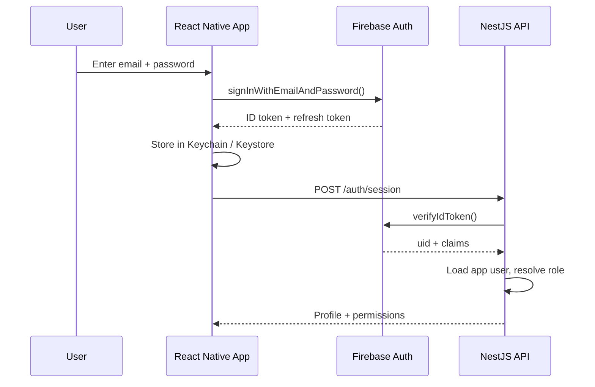

# 10. Security and Privacy

> [!info] Navigation
> ⬅️ [[09 API Specification]] · ➡️ [[11 Vehicle Health Score Algorithm]] · 🏠 [[AutoCare+ MOC]]

---

## 10.1 Authentication and session

| Control | Implementation |
|---|---|
| Token storage | iOS Keychain / Android Keystore — **never** AsyncStorage (NFR-018) |
| Token lifetime | Firebase ID token 1 h, auto-refreshed; app session inactivity limit 30 days (FR-015) |
| Biometric unlock | Optional local gate on app open; does not replace token auth |
| Sign-in throttling | 5 attempts/min per email address, then a cooling period; Firebase's own abuse detection applies on top (NFR-023) |
| Password policy | Minimum 8 characters, enforced client-side and by Firebase; reset only via emailed single-use link |
| Email verification | Required before a member can complete onboarding; unverified accounts can sign in but stay gated at consent |
| Staff accounts | Admin-provisioned only; no self-registration into staff roles |
| Certification flag | `is_certified_technician` gates inspection submission (BR-06, FR-058) |

---

## 10.2 Authorisation model

| Role | Can read | Can write |
|---|---|---|
| **Member** | Own profile, own vehicles, own subscriptions, own inspections, own invoices | Own profile, vehicles, bookings, approvals, certificates |
| **Fleet Manager** | All org vehicles and their records | Org vehicles, bookings, approvals |
| **Mechanic** | Vehicles on assigned work orders | Inspections on assigned work orders only |
| **Driver** | Assigned trips and their vehicles | Trip status, condition records, cash collections |
| **Service Advisor** | All operational records | Appointments, work orders, dispatch, cash |
| **Administrator** | Everything | Configuration, pricing, refunds, exports |
| **Public** 🌐 | A single shared certificate, redacted | Nothing |

Enforced by CASL abilities in a NestJS `PolicyGuard`, unit-tested as business logic. Row-level security in Postgres is enabled as a second layer that permits only the service role — see [[07 System Architecture#7.3 Reconciling Firebase Auth with Supabase RLS]].

---

## 10.3 Threat model

| # | Threat | Impact | Mitigation |
|---|---|---|---|
| T1 | Leaked Supabase anon key from a decompiled APK | Full data exposure | Clients never hold Supabase keys; RLS denies everything but the service role |
| T2 | Certificate token brute-forced to enumerate members' vehicles | Privacy breach | ≥128-bit random tokens, no sequential IDs, rate limiting, revocability (NFR-022) |
| T3 | Staff member records a fake cash collection | Financial loss | Every collection bound to user + shift; daily variance report; append-only audit log |
| T4 | Mechanic inflates a health score for a friend selling a car | Reputational and legal | Immutable inspections, mandatory photos on adverse findings, threshold-derived statuses, audit log, spot-check reviews |
| T5 | Replayed payment webhook double-credits an invoice | Financial loss | HMAC verification + unique `event_id` + raw-first persistence (FR-088) |
| T6 | Offline outbox replayed after device restore creates duplicate records | Data integrity | Client UUID idempotency keys with server-side receipts |
| T7 | Member's home address exposed via trip tracking | Physical safety | Location shared only while a trip is active; traces purged after 30 days |
| T8 | Stolen staff device with cached inspection data | Data exposure | Device PIN/biometric required, encrypted local DB, remote session revocation |
| T9 | Card data interception | PCI exposure | Card data never touches AutoCare+ — aggregator-hosted checkout only (FR-087) |
| T10 | Disputed score after a post-sale breakdown | Legal exposure | Visible inspection date, 90-day validity, confidence rating, explicit disclaimer, full audit trail |
| T11 | Free-tier quota exhaustion causing an outage | Availability | 80 % quota alarm job, containerised for rapid migration (NFR-036, NFR-045) |

---

## 10.4 Data Privacy Act (RA 10173) compliance

| Requirement | Implementation |
|---|---|
| **Lawful basis** | Contract performance for service data; explicit consent for marketing |
| **Consent capture** | Versioned policy text, timestamped, IP-logged in `consent_records` (FR-012) |
| **Transparency** | Privacy notice in-app in English and Filipino, versioned, acceptance recorded |
| **Purpose limitation** | Location used only for roadside and trips; never for background tracking |
| **Data minimisation** | VIN, email, and photos optional; only plate + contact are mandatory |
| **Right to access** | `POST /users/me/data-export` produces a machine-readable archive (FR-013) |
| **Right to erasure** | `POST /users/me/deletion-request`, fulfilled within 30 days (NFR-050) |
| **Right to correct** | Profile and vehicle details editable; inspections corrected by superseding record |
| **Security measures** | TLS 1.2+, AES-256 at rest, bcrypt/Argon2id, RBAC, audit logging |
| **Breach response** | Documented procedure: contain → assess → notify NPC and data subjects within 72 hours |
| **DPO** | A Data Protection Officer must be designated before launch — **action item for the owner** |

### The erasure vs. service-history tension

> [!warning] Resolve this before launch, with legal input
> NFR-057 says service records are never deleted (the resale proposition depends on it). The DPA gives members a right to erasure. The design resolves this by **anonymising rather than deleting**: personal identifiers are purged; the inspection, score, and service history remain attached to the *vehicle*, not the person.
>
> Two things must be true for this to hold:
> 1. The privacy notice states plainly, at registration, that vehicle service history is retained against the vehicle after account deletion.
> 2. The retained record contains nothing that identifies the former owner.
>
> This is a defensible position — vehicle history is arguably about the vehicle, and analogous to registration records — but it is not risk-free. Have it reviewed.

---

## 10.5 Application security checklist

| Area | Control |
|---|---|
| Transport | TLS 1.2+, HSTS, certificate validation enforced in the RN client |
| Input | `class-validator` DTOs on every endpoint; Zod schemas shared with clients |
| Injection | Prisma parameterised queries only; no raw SQL string interpolation |
| Secrets | Environment variables via the host's secret manager; never committed; `.env` git-ignored |
| Mobile binaries | Code obfuscation, no secrets in the bundle, root/jailbreak detection on the field app |
| Uploads | Signed URLs with short expiry, MIME and size validation, no user-controlled file paths |
| PDFs | Generated server-side; public certificates carry no personal contact details |
| Dependencies | Automated vulnerability scanning in CI; no release with a known critical CVE |
| Logs | Personal data redacted from logs; never log tokens, passwords, password-reset links, signed storage URLs, or full plate + owner pairs |
| Rate limiting | 5/min auth, 100/min general, per-IP and per-user |
| CORS | Admin console origin allow-list only |

---

## 10.6 Pre-launch security actions

- [ ] Designate a Data Protection Officer and register with the NPC if required
- [ ] Legal review of the erasure-vs-history position (§10.4)
- [ ] Legal review of the VHS disclaimer wording on public certificates
- [ ] Penetration test of the API before public launch
- [ ] Verify no Supabase or Firebase admin credentials are reachable from the mobile bundles
- [ ] Verify every Supabase Storage bucket is **private**, and that no object is retrievable without an API-minted signed URL
- [ ] Confirm the payment aggregator's PCI attestation covers your integration pattern
- [ ] Write and rehearse the breach response runbook
- [ ] Confirm backup restore actually works — test a full restore, don't assume

---

> [!info] Navigation
> ⬅️ [[09 API Specification]] · ➡️ [[11 Vehicle Health Score Algorithm]] · 🏠 [[AutoCare+ MOC]]
