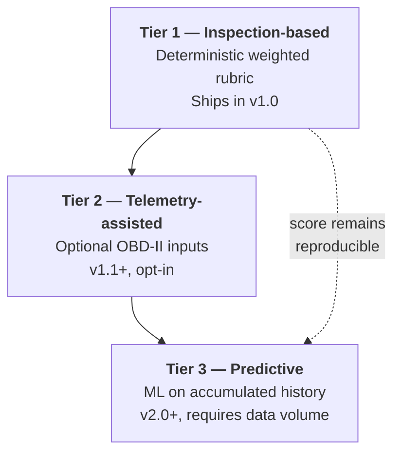

# 11. Vehicle Health Score (VHS) Algorithm

> [!info] Navigation
> ⬅️ [[07 System Architecture]] · ➡️ [[12 Screen Inventory]] · 🏠 [[AutoCare+ MOC]]

> [!abstract] This note answers the question: *how would the proprietary algorithm actually work, and is it feasible?*
> **Short answer: yes, and the feasible version is not the one that sounds most impressive.** The score should be a **deterministic, transparent, weighted rubric** over structured inspection data — not machine learning, and not raw sensor telemetry. Both of those are workarounds you graduate *into*, not out of. The three-tier design below lets you ship a real, defensible score in v1.0 and add sophistication later without invalidating past scores.

---

## 11.1 Why rule-based, not machine learning

| Approach | Feasible at launch? | Why / why not |
|---|---|---|
| **Weighted rubric over structured inspections** ✅ | **Yes** | Needs zero historical data. Fully explainable — you can show a buyer *why* the score is 84. Auditable and reproducible. Tunable by a mechanic, not a data scientist. |
| Machine-learned failure prediction | ❌ No | Requires thousands of vehicles with labelled outcomes ("this car broke down 4 months later"). You will not have that data for 2–3 years. A model trained on nothing produces confident nonsense. |
| Pure OBD-II telemetry scoring | ❌ Not alone | Reads engine fault codes well, but is blind to brakes, tyres, suspension, and body — which is most of what actually fails and most of what a buyer cares about. Also requires hardware in every car. |

> [!important] The decisive argument
> The VHS's business purpose is **resale trust** (per the concept document). A score a buyer cannot interrogate is worthless as trust. "84 because the front brake pads are at 3 mm and rear tyres are at 4 mm" builds trust. "84 because the model said so" does not. Explainability *is* the product here, not a compliance nicety.

**Verdict: build Tier 1 for v1.0. Design the data model so Tiers 2 and 3 can be added without a rewrite.**

---

## 11.2 Three-tier design



| Tier | Inputs | Output | When |
|---|---|---|---|
| **1** | Mechanic checklist: statuses + measured values | VHS 0–100 + category sub-scores | **v1.0** |
| **2** | Tier 1 + OBD-II DTCs, battery cranking voltage, engine hours | Same score, extra evidence, higher confidence rating | v1.1 |
| **3** | Tier 1+2 history across the fleet | Predicted time-to-failure per component | v2.0, needs ≈2 years of data |

---

## 11.3 Tier 1 — the algorithm in full

### Step 1 — Structured inspection input

Every inspection point produces a **status**, and where physically measurable, a **value**.

| Status | Condition factor `f` | Meaning |
|---|---|---|
| `GOOD` | **1.00** | Within spec, no action |
| `MONITOR` | **0.75** | Serviceable but wearing; check next visit |
| `ATTENTION` | **0.40** | Should be addressed soon |
| `CRITICAL` | **0.00** | Unsafe or imminent failure; address now |
| `NOT_APPLICABLE` | *excluded* | Not present on this vehicle (e.g. turbo on an NA engine) |

> [!note] Why 0.40 and not 0.50 for ATTENTION
> The gap between `MONITOR` and `ATTENTION` should be felt. A linear 1.0 / 0.66 / 0.33 / 0 scale makes a car with several `ATTENTION` items still score respectably, which understates real risk. The 1.00 / 0.75 / 0.40 / 0.00 curve is deliberately convex: minor wear barely moves the score, real problems move it hard.

### Step 2 — Threshold-derived status for measured points

Where a value can be measured, the system derives status automatically (FR-056), removing mechanic subjectivity. Thresholds are **configuration, not code** (FR-100).

| Inspection point | Unit | `GOOD` | `MONITOR` | `ATTENTION` | `CRITICAL` |
|---|---|---|---|---|---|
| Tyre tread depth | mm | ≥ 5.0 | 3.0 – 4.9 | 1.6 – 2.9 | < 1.6 |
| Brake pad thickness | mm | ≥ 7.0 | 4.0 – 6.9 | 2.0 – 3.9 | < 2.0 |
| Battery resting voltage | V | ≥ 12.6 | 12.40 – 12.59 | 12.00 – 12.39 | < 12.00 |
| Engine oil level | % of range | 80 – 100 | 60 – 79 | 40 – 59 | < 40 |
| Coolant level | % of range | 80 – 100 | 60 – 79 | 40 – 59 | < 40 |
| Brake fluid moisture | % | < 2.0 | 2.0 – 2.9 | 3.0 – 3.9 | ≥ 4.0 |
| Tyre pressure deviation | % from spec | ≤ 5 | 6 – 12 | 13 – 25 | > 25 |

> [!tip] This table is the single most valuable artefact in the whole algorithm
> It converts your head mechanic's judgement into something a junior technician reproduces identically. Have it reviewed and signed off by a qualified mechanic before launch — it is the difference between a credible score and a made-up number.

### Step 3 — Category sub-score

For each category *c*, over its applicable points *i*:

$$
S_c = 100 \times \frac{\sum_{i \in c} w_i \cdot f_i}{\sum_{i \in c} w_i}
$$

where `w_i` is the point's weight within its category and `f_i` its condition factor. `NOT_APPLICABLE` points drop out of **both** sums, so the score is never distorted by absent components.

### Step 4 — Category weights

> [!info] Updated per the AUTOCARE MEMBERSHIP APP FEATURES spec
> The original 8-category model is extended with **Emissions Systems** and **Sensors & Electronics**, both named explicitly in the feature spec. Weights below are rebalanced to keep the total at 100. This is a v1.0 change — unlike the 2D visualization work, expanding the checklist coverage requires no new UI paradigm, only more checklist points, so it ships now.

| Category | Weight `W_c` | Rationale |
|---|---|---|
| 🔧 Engine & Drivetrain | **18** | Highest repair cost; core of resale value |
| 🛑 Brakes | **16** | Safety-critical; direct injury risk |
| 🛞 Tyres & Wheels | **14** | Safety-critical; most common roadside failure |
| 🔋 Battery & Electrical | **11** | Most common no-start cause; cheap to fix, high nuisance |
| 💧 Fluids | **11** | Leading indicator; neglect here causes engine failures |
| ⚙️ Suspension & Steering | **9** | Handling safety; expensive but slower-developing |
| 💡 Lights & Visibility | **7** | Legal compliance; cheap to fix |
| 🌫️ **Emissions Systems** | **5** | O2 sensors, catalytic converter; LTO emissions-test compliance and engine efficiency |
| 🧠 **Sensors & Electronics** | **5** | Cruise control, airbags, dashboard warning lights; airbag-related points are safety-critical |
| 🚗 Body & Undercarriage | **4** | Cosmetic and corrosion; matters for resale, not safety |
| **Total** | **100** | |

> [!warning] Airbags are safety-critical even though the category isn't weighted like Brakes
> A low-weighted category can still contain a safety-critical **point**. The airbag warning-light point inside Sensors & Electronics is flagged `is_safety_critical = true`, so an active airbag fault still triggers the Step 6 override regardless of the category's modest 5-point weight. Category weight controls influence on the *average*; the safety-critical flag controls the *floor*. Don't confuse the two when tuning.

### New checklist points from this category expansion

| Category | New checklist point | Unit | `GOOD` | `MONITOR` | `ATTENTION` | `CRITICAL` |
|---|---|---|---|---|---|---|
| Emissions Systems | O2 sensor reading (voltage cross-count) | status only | Normal switching | Slow switching | Erratic | Inactive/fault |
| Emissions Systems | Catalytic converter efficiency (via OBD readiness monitor) | status only | Ready, pass | Ready, marginal | Not ready | Fault code active |
| Emissions Systems | Visible/smell exhaust abnormality | status only | None | Slight odour | Visible smoke | Heavy smoke |
| Sensors & Electronics | Airbag warning light | status only | Off | — | — | **On (safety-critical)** |
| Sensors & Electronics | Cruise control function | status only | Works normally | Intermittent | Non-functional | N/A |
| Sensors & Electronics | Dashboard warning lights (check engine, ABS, TPMS) | status only | None lit | 1 minor | 1 major or 2+ minor | Multiple / red warning |
| Sensors & Electronics | Sensor wiring/connector condition | status only | Good | Minor corrosion | Damaged, not disconnected | Disconnected/exposed |

These reuse the existing four-level status model (§11.3, Step 1) — no new scoring mechanics, just more inputs to the same formula.

> [!warning] These weights are a starting hypothesis, not truth
> They encode a safety-and-cost-weighted opinion. Version them (FR-101) and revisit annually against real failure data. Never change weights retroactively — old scores must remain reproducible (NFR-055).

### Step 5 — Raw overall score

$$
\text{VHS}_{\text{raw}} = \frac{\sum_c W_c \cdot S_c}{\sum_c W_c}
$$

Categories with no applicable points are excluded from both sums.

### Step 6 — Safety override (the critical rule)

> [!danger] A weighted average can hide a lethal fault
> A car with perfect everything except brake pads at 1 mm would still average into the 80s. That is unacceptable for a score a buyer relies on.

$$
\text{VHS} =
\begin{cases}
\min(\text{VHS}_{\text{raw}},\ 49) & \text{if any safety-critical point is } \texttt{CRITICAL} \\
\min(\text{VHS}_{\text{raw}},\ 69) & \text{if any safety-critical point is } \texttt{ATTENTION} \\
\text{VHS}_{\text{raw}} & \text{otherwise}
\end{cases}
$$

**Safety-critical points** (flagged `is_safety_critical` in configuration): all brake points, tyre tread and structural condition, steering linkage, all lights, windscreen/wipers, seatbelts.

The final score is rounded to the nearest integer and clamped to `[0, 100]`.

### Step 7 — Confidence rating

Displayed alongside the score, never blended into it.

| Confidence | Condition |
|---|---|
| **High** | ≥ 95 % of applicable points completed, inspection ≤ 30 days old |
| **Medium** | ≥ 85 % completed, or inspection 31–90 days old |
| **Low** | < 85 % completed, or inspection > 90 days old (`STALE`) |

---

## 11.4 Worked example

A 2018 sedan, 68,400 km, inspected today.

### Brakes category detail

| Point | Weight | Measured | Status | Factor `f` | `w × f` |
|---|---|---|---|---|---|
| Front brake pad thickness | 30 | 3.0 mm | `ATTENTION` | 0.40 | 12.00 |
| Rear brake pad thickness | 25 | 6.0 mm | `MONITOR` | 0.75 | 18.75 |
| Brake fluid condition | 20 | 1.4 % moisture | `GOOD` | 1.00 | 20.00 |
| Disc / rotor condition | 15 | — | `GOOD` | 1.00 | 15.00 |
| Parking brake | 10 | — | `GOOD` | 1.00 | 10.00 |
| **Σ** | **100** | | | | **75.75** |

$$S_{\text{Brakes}} = 100 \times \frac{75.75}{100} = \mathbf{75.8}$$

### Rolling up all categories

| Category | `W_c` | `S_c` | `W_c × S_c` |
|---|---|---|---|
| Engine & Drivetrain | 18 | 92.0 | 1656.0 |
| Brakes | 16 | 75.8 | 1212.8 |
| Tyres & Wheels | 14 | 70.0 | 980.0 |
| Battery & Electrical | 11 | 100.0 | 1100.0 |
| Fluids | 11 | 85.0 | 935.0 |
| Suspension & Steering | 9 | 90.0 | 810.0 |
| Lights & Visibility | 7 | 75.0 | 525.0 |
| Emissions Systems | 5 | 88.0 | 440.0 |
| Sensors & Electronics | 5 | 82.0 | 410.0 |
| Body & Undercarriage | 4 | 95.0 | 380.0 |
| **Σ** | **100** | | **8448.8** |

$$\text{VHS}_{\text{raw}} = \frac{8448.8}{100} = 84.488$$

**Safety override check:** the front brake pad is a safety-critical point at `ATTENTION` → cap at 69.

$$\text{VHS} = \min(84.488,\ 69) = \mathbf{69}$$

> [!example] What this demonstrates
> Without the override this car reads **84 — "Good"**, and a buyer walks away reassured while driving on 3 mm pads. With the override it reads **69 — "Fair, attention needed"**, and the member gets a concrete, sellable recommendation: *replace front brake pads*. The override is what makes the score honest, and honesty is what makes it worth money at resale.

---

## 11.5 Score bands

| Band | Range | Label (EN) | Label (FIL) | Colour | Stars | Member-facing meaning |
|---|---|---|---|---|---|---|
| 🟢 | 90–100 | Excellent | Napakaayos | Green | ★★★★★ | Well maintained; nothing needs attention |
| 🟢 | 75–89 | Good | Maayos | Light green | ★★★★☆ | Healthy; minor items to watch |
| 🟡 | 60–74 | Fair | Katamtaman | Amber | ★★★☆☆ | Serviceable, but some items need attention soon |
| 🟠 | 40–59 | Needs Attention | Kailangan ng Aksyon | Orange | ★★☆☆☆ | Address issues before extended driving |
| 🔴 | 0–39 | Critical | Delikado | Red | ★☆☆☆☆ | Unsafe to drive; service immediately |

> [!note] Stars are a display transform, not a second scoring system
> The spec calls for "0–100 or a star rating." Rather than maintain two scoring systems, the star count is derived purely from the band the numeric score already falls into — `stars = ceil(band_index)`. This applies at both the overall-score level and the **per-category level**, since the spec's worked example ("Battery — ★★★★☆") rates individual components, not just the overall vehicle. `category_scores` (see [[08 Data Model#Inspection and scoring entities]]) already stores a 0–100 `score` per category; the same band table converts it to stars for display. No new storage is needed.

### Per-component star example, from the spec

> **Battery — ★★★★☆**
> The battery is currently in good condition; however, its capacity has decreased slightly and should be monitored during subsequent inspections.

This is generated, not hand-written: the star count comes from the category's band (§11.5), and the sentence is templated from the category's dominant finding — the lowest-status point within that category, with its measured value substituted in. See §11.6a.

---

## 11.6 Score validity and decay

Per **BR-05**, a score is valid for **90 days**.

> [!note] Decay is a display state, not arithmetic
> The stored score value never changes — it is an immutable historical fact tied to a specific inspection (NFR-054). What changes is the **presentation**: after 90 days the certificate shows the score greyed out, labelled `STALE — inspected 142 days ago`, with confidence `Low`. Silently decaying the number would be dishonest and would break reproducibility.

---

## 11.6a Tap-to-explain: plain-language descriptions for every component

> [!info] From the spec
> "When the user selects or taps the component, the application could display a brief technical description explaining the basis for the assigned rating." — this must work for **every** component shown, not only the ones flagged as detractors.

`topDetractors` (§11.10) already generates this kind of sentence, but only for the worst 3 findings vehicle-wide. The spec asks for **on-demand detail for any tapped component**, so this is a distinct, always-available capability, not a bigger `topDetractors` list.

**Design:** every `category_scores` row and every `inspection_results` row is independently explainable, because the explanation is templated, not authored per vehicle:

```
"{ComponentLabel} — {stars}
{TemplateSentence(status, measuredValue, unit, threshold)}"
```

| Status | Template |
|---|---|
| `GOOD` | "{Component} is in good condition. No action needed at this time." |
| `MONITOR` | "{Component} is serviceable, but {measured} is approaching the recommended limit. Expected to need attention within {estimatedInterval}." |
| `ATTENTION` | "{Component} is at {measured}, below the recommended {threshold}. Servicing is recommended soon." |
| `CRITICAL` | "{Component} is at {measured}, well below the safe threshold of {threshold}. Address immediately." |

Applied to the spec's own example: Battery at 12.40 V, status `MONITOR` → *"Battery is currently in good condition; however, its capacity has decreased slightly and should be monitored during subsequent inspections."* This exact sentence is achievable by writing one good template per status per checklist point — a content task for whoever authors the checklist (see [[13 Constraints and Risks#Assumptions to validate before building]]), not a coding task.

| Requirement | Detail |
|---|---|
| **API** | `GET /vehicles/:id/health-score` already returns full `categoryScores`; each category and its constituent `inspection_results` are enough for the client to render the tap card without a second round trip |
| **Content ownership** | Templates live in `checklist_points.templates` (jsonb, one per status), editable by an admin alongside thresholds — not hard-coded in the client |
| **Fallback** | If a point has no `NOT_APPLICABLE`-excluded status template, fall back to a generic sentence built from status + measured value |
| **Where this surfaces** | Every category row on screen M-14 (Category breakdown) is tappable; tapping expands to show all its `inspection_results` with each point independently tappable to reveal its templated sentence |

---

## 11.6b Relationship to the (deferred) visual diagram

> [!info] Deferred to v1.1 — see [[13 Constraints and Risks#Roadmap — visual damage diagram (formerly "3D Repair Visualization")]]
> The original feature spec proposed a full 3D car model with tappable hotspots and simulated damage rendering. After a feasibility discussion, this is scoped down to a **2D exploded-diagram** with tappable zones, planned for **v1.1, member app only** — not the photorealistic 3D pipeline the reference images implied, and not in v1.0.

Even deferred, the relationship the spec describes — *VHS → Technical Assessment → Diagram → Spatial Identification* — is honoured by design, because §11.6a already produces exactly the payload a diagram needs:

```
VHS category/point → status + stars + templated sentence → diagram hotspot color + tap card
```

No rework of the scoring engine is required when the diagram ships: each `checklist_point` already carries (or will carry) a `diagram_zone_id` field reserved for this purpose (nullable until v1.1), so category scores map onto diagram regions without touching §11.3–§11.6a. This is the same "design the hook now, build the feature later" pattern used for Tier 2 telemetry (§11.8).

---

## 11.7 The peer comparison question

A common request: *"should an old car with 200,000 km be scored on the same scale as a new one?"*

**No adjustment to the headline score.** A 15-year-old car with 2 mm brake pads is exactly as dangerous as a new one with 2 mm brake pads. Age-normalising would inflate scores for the vehicles most likely to fail, and destroy the score's meaning for a buyer.

Instead, show a **separate, secondary metric**:

> **"84 — Good. Better than 78 % of vehicles of similar age and mileage in the AutoCare+ network."**

This gives the member the flattering context they want without corrupting the safety signal. It requires a fleet of at least ~200 scored vehicles to be meaningful — gate it behind that threshold and hide it until then.

---

## 11.8 Tier 2 — telemetry-assisted scoring

> [!info] Deferred to v1.1 — but designed for now
> The data model stores inspection points generically, with a `source` field (`MECHANIC` | `OBD` | `SENSOR`). Adding OBD-II later means inserting new points with `source = OBD`; no schema migration, no algorithm change.

| OBD-II input | Maps to | Effect |
|---|---|---|
| Active DTC (powertrain) | Engine → "Fault codes present" | `CRITICAL` for P0xxx active, `ATTENTION` for pending |
| Freeze-frame coolant temp | Engine → "Operating temperature" | Threshold-derived |
| Cranking voltage | Battery → "Cranking performance" | Threshold-derived |
| Fuel trim deviation | Engine → "Air/fuel mixture" | Threshold-derived |
| Readiness monitors incomplete | Confidence rating | Lowers confidence, does not lower score |

**Deployment options, cheapest first:**

1. **Workshop-only dongle** — one ₱1,500 Bluetooth OBD-II reader at the service centre, plugged in during each inspection. Costs almost nothing, covers every member, no member hardware. **This is the recommended path.**
2. Optional member-purchased dongle for continuous monitoring — revenue opportunity, but support burden.
3. Bundled dongle in the premium tier — strong differentiator, but adds hardware cost per subscriber.

> [!tip] Recommendation
> Option 1 gives you ~80 % of the telemetry benefit for ~2 % of the cost, and it can be added in v1.0 if the schedule allows, because it needs no member-side hardware or app changes.

---

## 11.9 Tier 3 — predictive scoring

Viable only once you hold roughly **2,000+ inspections with known outcomes** (a failure or repair that followed). Then a gradient-boosted model can predict per-component time-to-failure.

> [!warning] Do not put this in the feasibility study as a v1.0 capability
> Claiming predictive AI without the data to support it is the fastest way to lose credibility with a technical reviewer. Present it as a **roadmap item enabled by the data the Tier 1 system accumulates** — which is itself a strong strategic argument for the platform.

---

## 11.10 Implementation requirements

| Requirement | Detail |
|---|---|
| **Pure function** | `computeVHS(inspection, checklistVersion, weightVersion) → ScoreResult`. No I/O, no clock reads, no randomness. |
| **Versioned config** | Weights, thresholds, and factors live in the database with a version ID; every score stores the versions used (FR-101). |
| **Golden tests** | A fixture suite of ≥ 30 inspections with hand-verified expected scores, including every override path (NFR-039). |
| **Reproducibility test** | Recomputing any historical score with its stored versions must yield the identical value (NFR-055). |
| **Explainability payload** | The score result includes the per-category breakdown, the top 3 score-reducing points, and any override applied — so the UI can always answer "why?". |

### Return shape

```typescript
interface ScoreResult {
  score: number;                    // 0-100, integer
  rawScore: number;                 // pre-override, 3 dp
  band: 'EXCELLENT' | 'GOOD' | 'FAIR' | 'NEEDS_ATTENTION' | 'CRITICAL';
  stars: 1 | 2 | 3 | 4 | 5;           // derived from band, §11.5
  confidence: 'HIGH' | 'MEDIUM' | 'LOW';
  categoryScores: Array<{
    categoryId: string;
    label: string;
    weight: number;
    score: number;
    stars: 1 | 2 | 3 | 4 | 5;         // per-category star, for tap-to-explain UI (§11.6a)
    applicablePoints: number;
    diagramZoneId?: string;           // reserved for v1.1 visual diagram, §11.6b
  }>;
  overrideApplied: 'NONE' | 'SAFETY_CRITICAL' | 'SAFETY_ATTENTION';
  topDetractors: Array<{
    pointId: string;
    label: string;
    status: InspectionStatus;
    scoreImpact: number;            // points lost off 100
    recommendation: string;
  }>;
  checklistVersion: string;
  weightVersion: string;
  computedAt: string;               // ISO 8601
}
```

---

## 11.11 Feasibility verdict

| Dimension | Assessment |
|---|---|
| **Technical feasibility** | ✅ **High.** Tier 1 is arithmetic over a form. A competent developer implements and tests it in 3–5 days. The genuine effort is in authoring the checklist and thresholds — a mechanic's task, not a programmer's. |
| **Data feasibility** | ✅ **High.** Requires no historical data, no external dataset, no third-party integration. It is self-bootstrapping from day one. |
| **Defensibility as "proprietary"** | 🟡 **Moderate.** The formula is simple and copyable. The real moat is the **accumulated inspection history and its network trust**, not the maths. Position it that way in the feasibility study. |
| **Regulatory risk** | 🟡 **Moderate.** A score presented at resale could invite a dispute if a car fails soon after. Mitigate with a clear disclaimer, the 90-day validity rule, the confidence rating, and the visible inspection date on every certificate. |
| **Cost** | ✅ **Low.** No ML infrastructure, no per-inference cost, no hardware in v1.0. |

> [!success] Recommendation
> **Ship Tier 1 in v1.0**, now extended to 10 categories (§11.4) with star display and per-component tap-to-explain (§11.5–§11.6a) as specified in the AUTOCARE MEMBERSHIP APP FEATURES document. Add the workshop OBD-II dongle (Tier 2, Option 1) if schedule permits. Defer the visual diagram (§11.6b) to v1.1 — it is a UI/asset-pipeline feature layered on top of an already-complete data model, not a change to the scoring engine itself. Present Tier 3 as a roadmap item justified by accumulating data. This is honest, achievable, and still genuinely innovative for the Zamboanga City market.

---

## Related

- [[03 Functional Requirements#3.5 M5 — Inspection & Vehicle Health Score]] — FR-053 → FR-065
- [[08 Data Model#Inspection and scoring entities]] — how this is stored
- [[06 Use Cases#UC-005 — Perform a vehicle inspection]] — how a score gets created
- [[13 Constraints and Risks]] — what could go wrong

> [!info] Navigation
> ⬅️ [[07 System Architecture]] · ➡️ [[12 Screen Inventory]] · 🏠 [[AutoCare+ MOC]]
