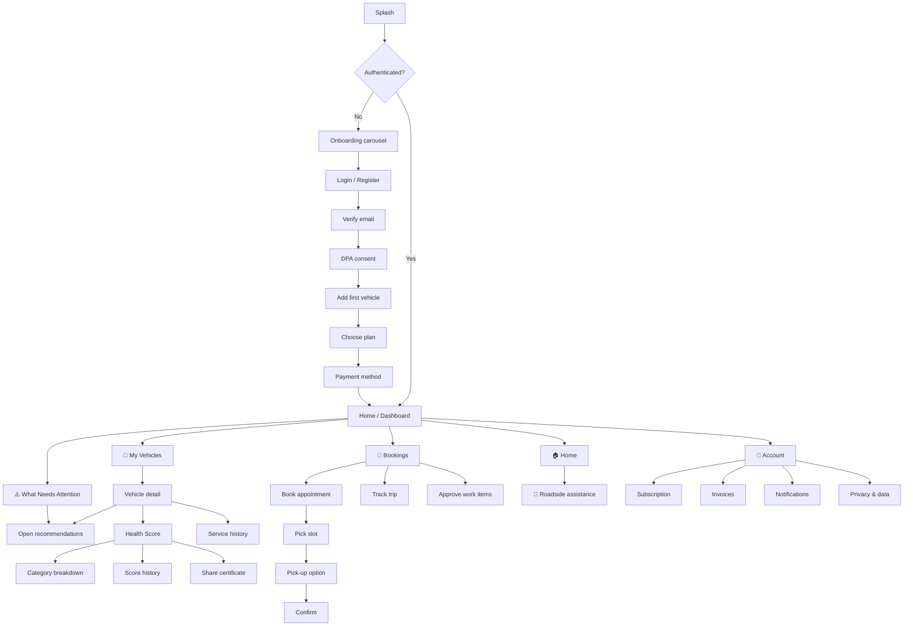

# 12. Screen Inventory

> [!info] Navigation
> ⬅️ [[11 Vehicle Health Score Algorithm]] · ➡️ [[13 Constraints and Risks]] · 🏠 [[AutoCare+ MOC]]

---

## 12.1 Member app navigation

### Member screens

| # | Screen | Purpose | Requirements |
|---|---|---|---|
| M-01 | Splash / auth check | Token validation, deep-link routing | — |
| M-02 | Onboarding carousel | Explain subscription value | — |
| M-03 | Login / Register | Email + password, or Google; mobile number captured as contact | FR-001 |
| M-04 | Verify email | "Check your inbox" state, resend timer, change-address link | FR-002 |
| M-05 | DPA consent | Versioned policy, explicit accept | FR-012 |
| M-06 | Add vehicle | Plate, make, model, odometer | FR-003 → FR-005 |
| M-07 | Vehicle photos / OR-CR | Optional document upload | FR-006 |
| M-08 | Plan selection | Compare tiers, inclusions, lock-in | FR-016 |
| M-09 | Payment method | COD or e-payment choice | FR-083, FR-084 |
| M-10 | **Home dashboard** | VHS gauge, next service, alerts, SOS button, **"What Needs Attention" summary card** | FR-031, FR-059, FR-109 |
| M-11 | My vehicles list | All vehicles with score badges | FR-003 |
| M-12 | Vehicle detail | Specs, score, history, recommendations | FR-004, FR-073 |
| M-13 | **Health Score** | Gauge, band, confidence, star rating, top detractors | FR-059, FR-060, FR-114 |
| M-14 | Category breakdown | Per-category scores with findings and photos; **tap any component for a plain-language explanation** | FR-060, FR-115 |
| M-15 | Score history | Trend chart over time and odometer | FR-062 |
| M-16 | **Share certificate** | Generate, share, revoke | FR-064, FR-065 |
| M-17 | Service history | Chronological record of closed work orders | FR-073 |
| M-18 | Recommendations | Open items, severity, estimated cost | FR-066, FR-069 |
| M-19 | Book appointment | Service type selection | FR-041 |
| M-20 | Slot picker | Calendar with real availability | FR-042, FR-043 |
| M-21 | Pick-up request | Address, time window, zone check | FR-075, FR-076 |
| M-22 | Booking confirmation | Summary, entitlement usage shown | FR-021 |
| M-23 | Bookings list | Upcoming and past | FR-041 |
| M-24 | Trip tracking | Driver info, live map | FR-080, FR-081 |
| M-25 | **Work approval** | Per-line approve / decline / defer | FR-067, FR-068 |
| M-26 | **Roadside request** | Incident type, location, confirm | FR-031 → FR-035 |
| M-27 | Roadside status | Live status timeline, hotline fallback | FR-038, FR-040 |
| M-28 | Subscription | Plan, next billing, entitlements, lock-in | FR-020, FR-021, FR-025 |
| M-29 | Plan change | Upgrade / downgrade | FR-023, FR-024 |
| M-30 | Cancellation flow | ETF quote, confirmation, retention offer | FR-028 |
| M-31 | Invoices & receipts | List with PDF download | FR-029 |
| M-32 | Odometer update | Quick entry | FR-048 |
| M-33 | Notifications centre | Read/unread, preferences | FR-092, FR-093 |
| M-34 | Profile & account | Details, emergency contact | FR-011 |
| M-35 | Privacy & data | Export, deletion, consent history | FR-013 |
| M-36 | Feedback | Post-service rating | FR-108 |
| M-37 | Fleet dashboard | Fleet-only aggregate view | FR-105 |
| M-38 | **"What Needs Attention" — full list** | All open items across all vehicles, sorted by severity, deep-linking to source screens | FR-109 → FR-111 |
| M-39 | ⚪ **2D component diagram** | Exploded-diagram view with tappable, colour-coded zones | FR-116 — **deferred to v1.1** |
| M-40 | ⚪ Diagram zone detail | Tap-through from a diagram zone to its explanation card | FR-117 — **deferred to v1.1** |

> [!note] M-39 and M-40 are documented, not built, in v1.0
> They're listed here so the navigation map and data model stay consistent with the roadmap item in [[13 Constraints and Risks#Roadmap — visual damage diagram (formerly "3D Repair Visualization")]], and so a future implementer doesn't have to reverse-engineer where they'd fit.

---

## 12.2 Field app screens (React Native — mechanics & drivers)

> [!important] Design rules for field screens
> ≥ 56 dp tap targets (gloved hands), high contrast for outdoor sunlight, minimal text entry, and a **persistent offline banner** showing pending sync count. See [[04 Non-Functional Requirements#4.4 Usability]].

| # | Screen | Role | Requirements |
|---|---|---|---|
| F-01 | Staff login | All | FR-007 |
| F-02 | Today's task list | All | — |
| F-03 | **Offline sync banner / queue detail** | All | FR-057, FR-082 |
| F-04 | Work order detail | Mechanic | FR-070 |
| F-05 | **Inspection — category navigator** | Mechanic | FR-053, FR-054 |
| F-06 | **Inspection — point entry** | Mechanic | FR-055, FR-056 |
| F-07 | Photo capture & annotate | Mechanic | FR-055 |
| F-08 | Inspection review & submit | Mechanic | FR-057, FR-058 |
| F-09 | Score result & recommendations | Mechanic | FR-059, FR-066 |
| F-10 | **Waste record entry** | Mechanic | FR-074 |
| F-11 | Trip list (my trips) | Driver | FR-077 |
| F-12 | **Pre-trip condition capture** | Driver | FR-078 |
| F-13 | Navigation to address | Driver | FR-075 |
| F-14 | Hand-over signature | Driver | FR-079 |
| F-15 | **COD collection** | Driver | FR-085 |
| F-16 | Cash shift open / close | Driver | FR-086 |
| F-17 | Roadside response (assigned) | Driver | FR-038 |
| F-18 | Roadside dispatch — mobile fallback | Advisor | FR-036, FR-037 |

---

## 12.3 Web application (Next.js)

One Next.js codebase, three route groups. Reasoning in [[07 System Architecture#7.4a Web application architecture (Next.js)]].

### 12.3a Advisor desk portal — `/staff`

> [!important] Why these are web screens
> Every screen here is a dense, multi-column, keyboard-driven view used at a counter. These are the busiest workflows in the business and the ones most degraded by a small screen.

| # | Screen | Requirements |
|---|---|---|
| W-01 | Staff login (session cookie) | FR-007 |
| W-02 | **Schedule board — day / week / bay** | FR-049 |
| W-03 | Create / move / drag appointment | FR-050 |
| W-04 | Capacity blocks & walk-in buffer | FR-050 |
| W-05 | Work order detail & status | FR-070 |
| W-06 | **Quote builder** — parts + labour lines | FR-071 |
| W-07 | Request approval / approval tracker | FR-067 |
| W-08 | Parts lookup & stock | FR-072 |
| W-09 | Waste record review | FR-074 |
| W-10 | **Roadside dispatch queue (live)** | FR-036 |
| W-11 | Dispatch responder | FR-037 |
| W-12 | Trip assignment board | FR-077 |
| W-13 | COD collection at counter | FR-085 |
| W-14 | Cash shift open / close | FR-086 |
| W-15 | Member & vehicle lookup | FR-014 |

### 12.3b Admin console — `/admin`

| # | Screen | Requirements |
|---|---|---|
| A-01 | Dashboard — MRR, churn, active subs, utilisation | FR-096, FR-052 |
| A-02 | Members & vehicles browser | FR-014 |
| A-03 | Plan builder — pricing, entitlements, lock-in | FR-030 |
| A-04 | **Checklist editor** — categories, points, thresholds | FR-100 |
| A-05 | **Weight editor** — category and point weights, versioned | FR-100, FR-101 |
| A-06 | Service types & durations | FR-051 |
| A-07 | Bays, shifts, holidays, walk-in buffer | FR-051 |
| A-08 | Service zones & surcharges | FR-104 |
| A-09 | Entitlement redemption report | FR-097 |
| A-10 | Parts margin report | FR-098 |
| A-11 | Roadside cost-per-member report | FR-099 |
| A-12 | **Waste log export (DENR)** | FR-102 |
| A-13 | Remittance reconciliation | FR-086 |
| A-14 | Refunds | FR-089 |
| A-15 | Audit log viewer | FR-103 |
| A-16 | Announcements | FR-107 |
| A-17 | Free-tier quota monitor | NFR-045 |

### 12.3c Public pages — server-rendered 🌐

| # | Screen | Requirements |
|---|---|---|
| P-01 | **VHS certificate page** — score, breakdown, history summary, verification code | FR-064, NFR-035b |
| P-02 | Certificate verification form | FR-064 |
| P-03 | Revoked / expired certificate notice | FR-065 |
| P-04 | Privacy policy & terms (versioned) | NFR-053 |

> [!note] P-01 is the reason the web app must be Next.js rather than a client-rendered SPA
> A certificate link pasted into Facebook Marketplace or a Viber chat needs a server-rendered OpenGraph preview showing the score. A blank preview card destroys the trust signal the whole feature exists to create.

---

## 12.4 Screen count

| Client | Surface | Screens | Of which deferred (v1.1) |
|---|---|---|---|
| Member app (React Native) | — | 40 | 2 (M-39, M-40) |
| Field app (React Native) | mechanics, drivers | 18 | 0 |
| Web app (Next.js) | advisor desk `/staff` | 15 | 0 |
| Web app (Next.js) | admin console `/admin` | 17 | 0 |
| Web app (Next.js) | public 🌐 | 4 | 0 |
| **Total** | | **94** | **2** |
| **v1.0 buildable total** | | **92** | |

> [!danger] Read this alongside the scope constraint
> 92 buildable v1.0 screens across three clients is a large build, up from 91 after integrating the AUTOCARE MEMBERSHIP APP FEATURES spec — one net new screen (M-38, the full attention list), since the two diagram screens are deferred and don't count against v1.0. This is a direct consequence of constraint **C-06** (full-feature MVP). [[13 Constraints and Risks#13.2 Scope constraint — full-feature MVP]] converts this into an effort estimate and proposes a fallback ordering if the timeline compresses.

> [!tip] The split slightly *reduces* effort versus the alternative
> Moving advisor and admin work to Next.js removes 6 complex screens from the React Native field app — where dense tables and drag-and-drop schedule boards are expensive to build — and puts them somewhere they are cheap. The field app drops from 24 screens to 18, and the ones remaining are the simple, camera-and-GPS screens React Native is genuinely good at.

---

> [!info] Navigation
> ⬅️ [[11 Vehicle Health Score Algorithm]] · ➡️ [[13 Constraints and Risks]] · 🏠 [[AutoCare+ MOC]]
