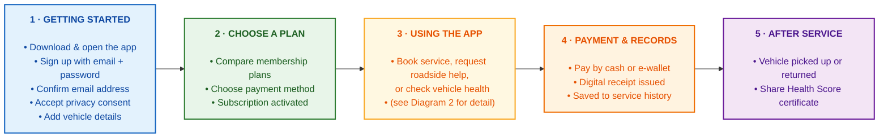

# 16. Application Flow Diagram

> [!info] Navigation
> ⬅️ [[18 Project Description]] · ➡️ [[17 Technology Architecture Diagram]] · 🏠 [[AutoCare+ MOC]]

> [!abstract] Purpose of this document
> This is a **visual walkthrough** of how a member moves through the AutoCare+ app, from installing it to sharing a Vehicle Health Score certificate. It is drawn from the full requirements and use cases already documented in [[03 Functional Requirements]] and [[06 Use Cases]], simplified into diagrams that don't require a technical background to read. If you're presenting this to a client or stakeholder, start here.

---

## 16.1 How to read these diagrams

- **Boxes** are a screen, action, or system step.
- **Arrows** show what happens next.
- **Diamond shapes** are a decision point — the app or the member is choosing between paths.
- **Colour** groups steps that belong to the same stage or lane; it has no other meaning.
- **Dashed arrows** show an optional or secondary path (for example, looping back to book a repair after checking the dashboard).

---

## 16.2 Diagram 1 — End-to-End Journey Overview

This is the big picture: five stages every member passes through, from download to after-service.

### What's happening at each stage

| Stage | What the member experiences | Source requirements |
|---|---|---|
| **1 · Getting Started** | The member downloads the app, signs up with an email address and password, confirms that address by tapping a link they're sent, agrees to the privacy policy, and registers their vehicle's basic details. | [[03 Functional Requirements#3.1 M1 — Identity & Accounts]] |
| **2 · Choose a Plan** | The member compares the Basic and Premium membership plans, picks how they'll pay (cash or e-wallet), and their subscription goes live. | [[03 Functional Requirements#3.2 M2 — Subscription & Billing]] |
| **3 · Using the App** | This is where members spend most of their time — booking services, checking their car's health, or requesting emergency help. Diagram 2 below breaks this stage down in detail. | [[03 Functional Requirements#3.4 M4 — Scheduling & Capacity]] |
| **4 · Payment & Records** | Once a service is done, the member pays (in cash or through GCash/Maya/card), gets a digital receipt, and the visit is automatically added to their vehicle's permanent service history. | [[03 Functional Requirements#3.8 M8 — Payments]] |
| **5 · After Service** | The member gets their vehicle back, and can optionally generate a shareable Health Score certificate — useful proof of maintenance if they ever sell the car. | [[03 Functional Requirements#3.5 M5 — Inspection & Vehicle Health Score]] |

---

## 16.3 Diagram 2 — Core In-App Service Flow

This zooms into **Stage 3** above — the three things a member can do inside the app, and how each one unfolds.

```mermaid
flowchart LR
    START(["Member opens the app"]) --> D1{"What do you need today?"}

    D1 -->|Routine service| A1
    D1 -->|Emergency| B1
    D1 -->|Check my car| C1

    subgraph ROUTINE["ROUTINE SERVICE"]
        direction LR
        A1["Book Appointment"] --> A2["Pick-up/Delivery or Drop-off"]
        A2 --> A3["Mechanic Inspects Vehicle"]
        A3 --> A4["Health Score & Recommendations"]
        A4 --> D2{"Repairs needed?"}
        D2 -->|Yes| A5["Approve Recommended Repairs"]
    end

    subgraph EMERGENCY["ROADSIDE EMERGENCY"]
        direction LR
        B1["Request Roadside Assistance"] --> B2["Share Current Location"]
        B2 --> B3["Help Dispatched & Tracked Live"]
    end

    subgraph CHECKHEALTH["CHECK VEHICLE HEALTH"]
        direction LR
        C1["Open Health Score Dashboard"] --> C2["View 'What Needs Attention' List"]
    end

    C2 -.->|Wants to book a fix| A1
    D2 -->|No| DONE["Service Completed"]
    A5 --> DONE
    B3 --> DONE
    DONE --> PAY(["Continue to Payment"])

    classDef routine fill:#FFE082,stroke:#F9A825,color:#E65100;
    classDef emergency fill:#FFCDD2,stroke:#C62828,color:#B71C1C;
    classDef health fill:#B3E5FC,stroke:#0277BD,color:#01579B;
    classDef decision fill:#FFF3CD,stroke:#B8860B,color:#7a5c00;
    classDef done fill:#C8E6C9,stroke:#1B5E20,color:#1B5E20;
    classDef terminal fill:#ECEFF1,stroke:#37474F,color:#263238;

    class A1,A2,A3,A4,A5 routine
    class B1,B2,B3 emergency
    class C1,C2 health
    class D1,D2 decision
    class DONE done
    class START,PAY terminal
```

### The three paths, explained

> [!note] Routine Service (yellow)
> The most common path. The member books a service, chooses whether AutoCare+ picks up their car or they drop it off, a mechanic inspects it, and the app generates a **Vehicle Health Score** with any recommended repairs. If repairs are needed, the member approves them individually before any work happens — nothing is done to their car without their sign-off. Full detail: UC-003 and UC-006 in [[06 Use Cases#6.1 Actor–goal list]], and [[06 Use Cases#UC-005 — Perform a vehicle inspection]].

> [!note] Roadside Emergency (red)
> For breakdowns — a flat tyre, dead battery, or being stranded on the road. The member shares their location, and help is dispatched and tracked live in the app, the same way a ride-hailing app tracks a driver. Full detail: [[06 Use Cases#UC-007 — Request roadside assistance]].

> [!note] Check Vehicle Health (blue)
> The member opens their dashboard at any time — not tied to a booking — to see their car's current health score and a **"What Needs Attention"** list: a plain summary of anything that needs looking at. From there, they can jump straight into booking a fix. Full detail: [[03 Functional Requirements#3.11 M11 — Attention Dashboard & Component Visualization]].

---

## 16.4 Handoff Notes — Read This Before Sharing With Your Client

> [!important] Purpose of this section
> This section exists so that when this document is shared with a non-technical client, they can follow it without needing you in the room to translate. It defines every term a client is likely to stumble on, and flags what's built now versus later.

### Plain-language glossary for this diagram

| Term in the diagram | What it means, in plain terms |
|---|---|
| **Email verification** | A one-time link sent to the address a member signs up with. Tapping it proves the address is really theirs — the same step most online services use — and it replaces the SMS code approach described in earlier drafts. |
| **Vehicle Health Score (VHS)** | A single number (and star rating) summarizing how healthy the car is, generated automatically after every inspection — like a report card for the vehicle. |
| **"What Needs Attention" list** | A simple, always-visible list on the home screen telling the member exactly what to fix and why, instead of them having to dig through menus. |
| **Entitlement / plan quota** | What's included in a membership plan each month (for example, "1 inspection per month"). Doesn't appear directly in this diagram, but governs what "Book Appointment" allows. |
| **E-wallet** | A digital payment app like GCash or Maya — the Philippine equivalent of a mobile wallet. |
| **Digital service history** | A permanent online record of everything ever done to the vehicle, replacing paper receipts. |
| **Certificate** | A shareable web link / PDF showing the car's health score and service history — useful when selling the car, since it proves it was properly maintained. |

### What's live now vs. planned later

| Item | Status |
|---|---|
| Everything shown in both diagrams above | **Included in the first release (v1.0)** |
| A visual, interactive diagram of the car itself (tap a part of the car to see its condition) | **Planned for a later release (v1.1)** — not shown here since it isn't part of the first version. See [[13 Constraints and Risks#Roadmap — visual damage diagram (formerly "3D Repair Visualization")]] for why. |

### Questions a client will likely ask, answered in advance

> [!faq]- "Does the client have to approve every single repair?"
> Yes — see the "Repairs needed?" decision point in Diagram 2. No work happens on a member's car without them explicitly approving it in the app first. This is a deliberate trust-building feature, not a limitation.

> [!faq]- "What happens if the member doesn't have a smartphone or data connection?"
> The diagrams assume a smartphone with mobile data, which is the target user for a mobile-first app like this. Members without a compatible device would need to visit or call the physical shop directly — that fallback isn't part of the app itself.

> [!faq]- "Can a member pay in cash, or is it card-only?"
> Cash is fully supported, shown as "Pay by cash or e-wallet" in Stage 4. This was a deliberate choice — see [[13 Constraints and Risks#COD versus recurring subscription]] for why cash matters for this market.

> [!faq]- "Is this the final design, or will screens look different?"
> These are **flow diagrams**, not screen designs — they show the sequence of steps and decisions, not what the app will look like. Actual screen layouts are a separate design phase; see [[12 Screen Inventory]] for the full list of planned screens.

---

## Related

- [[06 Use Cases]] — the detailed, technical version of the flows shown here
- [[03 Functional Requirements]] — every requirement these diagrams are built from
- [[17 Technology Architecture Diagram]] — what's running behind the scenes to make this flow work
- [[12 Screen Inventory]] — the actual screens that implement each step

> [!info] Navigation
> ⬅️ [[18 Project Description]] · ➡️ [[17 Technology Architecture Diagram]] · 🏠 [[AutoCare+ MOC]]
