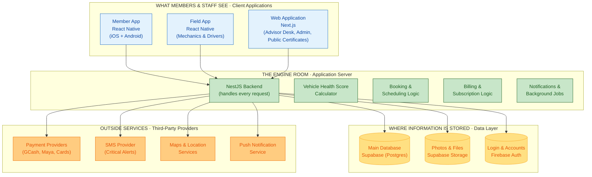

# 17. Technology Architecture Diagram

> [!info] Navigation
> ⬅️ [[16 Application Flow Diagram]] · 🏠 [[AutoCare+ MOC]]

> [!abstract] Purpose of this document
> This shows **what AutoCare+ is built with**, in four plain layers, and explains why each piece was chosen. It's the visual counterpart to [[07 System Architecture]], which covers the same ground in full technical detail. Use this version when presenting the technology choices to a client or non-technical stakeholder.

---

## 17.1 How to read this diagram

Think of it like a building: what people see (the apps), the engine room that does the work (the server), where records are filed (storage), and outside contractors the business relies on (payment providers, SMS, maps). Every arrow means "talks to" — information flows from client apps down through the server to storage and outside services, and back.

---

## 17.2 The diagram

---

## 17.3 Technology at a glance

Each row is a tool or service, what it actually does in plain terms, and which features it powers.

| Layer | Technology | Plain-English purpose | Powers these features |
|---|---|---|---|
| Client | **React Native** (Member App) | One codebase that produces both the iOS and Android app, instead of building two separate apps | Registration, booking, health score viewing, payments, roadside requests |
| Client | **React Native** (Field App) | The same framework, built into a separate app for mechanics and drivers, usable without an internet connection | Vehicle inspections, pick-up/delivery trip tracking, cash collection |
| Client | **Next.js** (Web Application) | A website framework that powers three separate things from one codebase: the service advisor's desk screen, the admin dashboard, and the public health-certificate pages anyone can view via a shared link | Scheduling board, reporting, plan/pricing management, shareable Health Score certificates |
| Server | **NestJS** | The central program that every app (member, field, web) talks to. It enforces every business rule — who can do what, what a plan includes, how billing works — in one place, so the rules are consistent everywhere | Every feature in the app, without exception |
| Server | **Vehicle Health Score Calculator** | A dedicated piece of logic, inside the backend, that turns a mechanic's inspection into the 0–100 score and star rating members see | Health scores, "What Needs Attention" dashboard, shareable certificates |
| Data | **Supabase (Postgres)** | The main database — where every vehicle, booking, subscription, and inspection record actually lives | All records and history in the app |
| Data | **Supabase Storage** | Where photos (inspection photos, vehicle photos, documents) and generated certificate PDFs are kept — the same provider as the database, so there is one account and one bill for all stored information | Inspection photo capture, document uploads, health certificates |
| Data | **Firebase Auth** | Handles sign-up and login with an email address and password (or a Google account), plus "forgot password" emails | Sign-up, login, password reset |
| Outside | **Payment Providers** (GCash, Maya, card processors) | Lets members pay through the e-wallets and cards Filipino consumers already use, without AutoCare+ ever handling raw card numbers | Subscription billing, work-order payments |
| Outside | **SMS Provider** | Sends critical alerts (e.g. "your roadside help is on the way") as text messages, as a backup to app notifications | Critical alerts when the app can't reach the phone |
| Outside | **Maps & Location Services** | Turns a GPS pin into a readable address and shows a live map of dispatched help or a delivery driver | Pick-up requests, roadside assistance tracking |
| Outside | **Push Notification Service** | Sends the everyday reminders and updates — "your appointment is tomorrow," "your car is ready" | Appointment reminders, status updates, service-due alerts |

---

## 17.4 Handoff Notes — Read This Before Sharing With Your Client

> [!important] Purpose of this section
> Technology choices are one of the first things a client questions, especially around cost and vendor risk. This section pre-answers the likely questions in plain language, without requiring you to explain the technical architecture live.

### Plain-language glossary for this diagram

| Term | What it means, in plain terms |
|---|---|
| **Backend / server** | The "engine room" — the part of the app nobody sees directly, but which does all the actual work: checking who's allowed to do what, calculating scores, processing payments. |
| **Database** | Where all the information is permanently stored — every member, vehicle, booking, and inspection record. Think of it as a very large, extremely organized filing cabinet. |
| **API** | The "language" the apps use to ask the server for information or tell it to do something (e.g., "book this appointment"). Not shown as a separate box here — it's built into the NestJS backend. |
| **Cloud hosting** | The server and database run on rented computing infrastructure over the internet, rather than on a physical computer in the shop. This is standard for any modern app and is what makes the app accessible from anywhere. |
| **Free tier** | Several of the outside tools (the database and login service specifically) offer a free usage allowance before any cost kicks in — meaningful for keeping early costs low, with a plan to upgrade as the business grows. See [[13 Constraints and Risks#13.1 Locked constraints]] for the specific quotas. |
| **Third-party provider** | A company AutoCare+ pays or partners with instead of building that capability itself — for example, using an existing payment company instead of building payment processing from scratch, which would be slow, expensive, and risky to get right. |
| **Vendor lock-in** | The risk of depending so heavily on one outside provider that switching later becomes difficult or expensive. Addressed directly in the architecture — see the note below. |

### Questions a client will likely ask, answered in advance

> [!faq]- "Why do we need so many different outside tools instead of building everything in-house?"
> Each of these (payments, SMS, maps, push notifications) is a solved problem elsewhere, and building any one of them from scratch would take months and carry real risk (especially payments, which involves handling money and complying with banking regulations). Using established providers for these pieces means faster delivery and fewer places for something to go wrong, while all of AutoCare+'s actual business logic — pricing, scheduling, health scoring — stays custom-built and owned by the business.

> [!faq]- "What if one of these companies raises their prices or shuts down?"
> This was accounted for directly in the design. The backend is built so that the database, the file storage, and the login service can each be swapped for a different provider without rewriting the apps — see [[07 System Architecture#7.3 Reconciling Firebase Auth with Supabase RLS]] for the technical detail. The system isn't permanently tied to any one vendor.

> [!faq]- "Does the business own the app, or does it belong to whoever builds it?"
> The architecture and all custom code (the NestJS server, the mobile and web apps, the scoring algorithm) belong entirely to the business. The outside services are pay-as-you-go tools the app *uses*, the same way a shop uses a card payment terminal without owning the card network.

> [!faq]- "Is customer data safe?"
> Yes — this is covered in full in [[10 Security and Privacy]], including compliance with the Philippine Data Privacy Act. In short: passwords and sensitive data are encrypted, card numbers never touch AutoCare+'s own servers, and every sensitive action is logged.

> [!faq]- "Why two mobile apps instead of one?"
> Members and staff need very different things. Members need a polished, simple app. Mechanics and drivers need something that works reliably with a spotty signal in the field and survives being used one-handed while holding a tool. Separating them keeps each app focused and easier to use for its actual audience — see [[02 Overall Description#2.2 User classes and characteristics]].

---

## Related

- [[07 System Architecture]] — the full technical version of this diagram, with implementation detail
- [[08 Data Model]] — what's actually stored in the database shown here
- [[10 Security and Privacy]] — how member and vehicle data is protected
- [[13 Constraints and Risks]] — costs, quotas, and vendor risk in detail

> [!info] Navigation
> ⬅️ [[16 Application Flow Diagram]] · 🏠 [[AutoCare+ MOC]]
